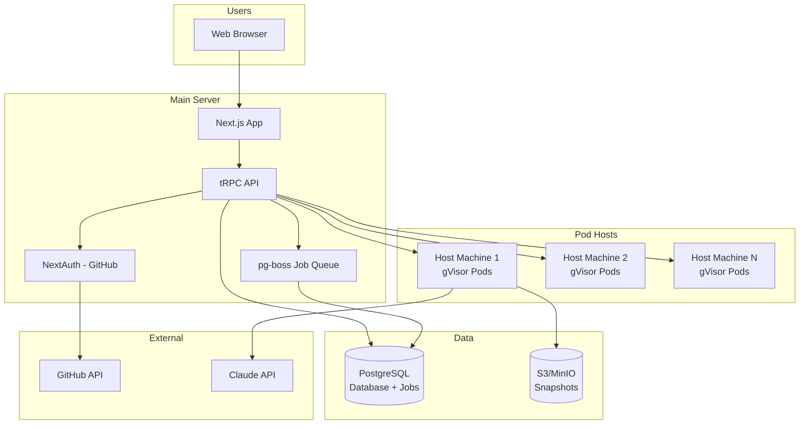

# System Architecture

## Simplified Architecture



## Component Details

### 1. Main Server

Single server that can be vertically scaled as needed. Handles:
- Frontend serving
- API requests
- Authentication
- Job processing

```typescript
// Simple architecture - everything runs on one server
const server = {
  cpu: '8 cores',
  memory: '32 GB',
  disk: '500 GB SSD',
  canHandle: '1000+ concurrent users'
};
```

### 2. Database (PostgreSQL)

Single PostgreSQL instance handles both data and job queue:

```sql
-- Core tables
CREATE TABLE users (
  id UUID PRIMARY KEY,
  email VARCHAR(255) UNIQUE,
  github_id VARCHAR(255) UNIQUE,
  github_username VARCHAR(255),
  created_at TIMESTAMP DEFAULT NOW()
);

CREATE TABLE teams (
  id UUID PRIMARY KEY,
  name VARCHAR(255),
  owner_id UUID REFERENCES users(id),
  created_at TIMESTAMP DEFAULT NOW()
);

CREATE TABLE pods (
  id UUID PRIMARY KEY,
  name VARCHAR(255),
  owner_id UUID REFERENCES users(id),
  team_id UUID REFERENCES teams(id),
  host_ip VARCHAR(45),
  internal_ip VARCHAR(45),
  status VARCHAR(50),
  tier VARCHAR(50),
  github_repo VARCHAR(500),
  config JSONB,
  created_at TIMESTAMP DEFAULT NOW()
);

CREATE TABLE ssh_keys (
  id UUID PRIMARY KEY,
  pod_id UUID REFERENCES pods(id) ON DELETE CASCADE,
  public_key TEXT,
  private_key_encrypted TEXT,
  github_key_id VARCHAR(100),
  created_at TIMESTAMP DEFAULT NOW()
);

CREATE TABLE secrets (
  id UUID PRIMARY KEY,
  name VARCHAR(255),
  value_encrypted TEXT,
  owner_id UUID REFERENCES users(id),
  project_ref VARCHAR(500),
  created_at TIMESTAMP DEFAULT NOW()
);

-- pg-boss will create its own job tables
```

### 3. Job Queue (pg-boss)

PostgreSQL-based job queue - no Redis needed:

```typescript
import PgBoss from 'pg-boss';

const boss = new PgBoss({
  connectionString: process.env.DATABASE_URL,
  schema: 'pgboss'
});

// Start the boss
await boss.start();

// Simple job definitions
await boss.work('provision-pod', async (job) => {
  const { podId, config } = job.data;
  await provisionPod(podId, config);
});

await boss.work('cleanup-pod', async (job) => {
  const { podId } = job.data;
  await cleanupPod(podId);
});

// Send jobs
await boss.send('provision-pod', { podId, config });
```

### 4. Pod Host Communication

Two simple options:

#### Option A: Direct SSH (Simpler)
```typescript
class PodManager {
  async createPod(hostIp: string, config: PodConfig) {
    const ssh = new SSH2.Client();
    await ssh.connect({
      host: hostIp,
      username: 'pinacle',
      privateKey: MASTER_SSH_KEY
    });

    await ssh.exec(`
      /usr/local/bin/create-pod.sh \
        --id ${config.podId} \
        --cpu ${config.cpu} \
        --memory ${config.memory}
    `);
  }
}
```

#### Option B: Simple HTTP Agent
```typescript
// Agent running on each host
app.post('/create-pod', async (req, res) => {
  const { podId, config } = req.body;

  if (req.headers['x-api-key'] !== HOST_API_KEY) {
    return res.status(401).send('Unauthorized');
  }

  await createGvisorContainer(podId, config);
  res.json({ success: true, ip: podIp });
});
```

## Resource Tiers

| Tier | CPU | Memory | Storage | Price/Month |
|------|-----|--------|---------|-------------|
| dev.small | 0.5 vCPU | 1 GB | 10 GB | $6 |
| dev.medium | 1 vCPU | 2 GB | 20 GB | $12 |
| dev.large | 2 vCPU | 4 GB | 40 GB | $24 |
| dev.xlarge | 4 vCPU | 8 GB | 80 GB | $48 |

## Scaling Strategy

### Vertical Scaling (Primary)
- Main server: Upgrade CPU/RAM as needed
- PostgreSQL: Can handle 10,000+ users on single instance
- Start with 8GB RAM, scale to 64GB+ as needed

### Horizontal Scaling (Pod Hosts Only)
- Add more host machines as pod count grows
- Each host can run ~30-50 pods depending on tier mix
- Simple round-robin or least-loaded allocation

## Security

### Simple Security Model
- GitHub OAuth for authentication
- JWT tokens for API access
- gVisor for pod isolation
- Encrypted secrets in database
- HTTPS everywhere

### No Complex Features (Yet)
- ❌ No RBAC - just owner/member
- ❌ No key rotation - keys last pod lifetime
- ❌ No audit logging - basic logs only
- ❌ No compliance features

## Networking

### Subdomain Routing
```nginx
# Simple nginx config
server {
    server_name ~^(?<service>[^-]+)-(?<pod>[^-]+)-(?<user>[^.]+)\.pinacle\.dev$;

    location / {
        # Look up pod IP from database
        set $target '';
        access_by_lua_block {
            -- Query PostgreSQL for pod IP
            local pod_ip = get_pod_ip(ngx.var.pod, ngx.var.user)
            ngx.var.target = pod_ip
        }

        proxy_pass http://$target;
        proxy_http_version 1.1;
        proxy_set_header Upgrade $http_upgrade;
        proxy_set_header Connection "upgrade";
    }
}
```

## Monitoring

### Simple Monitoring
- Basic health checks via HTTP endpoints
- PostgreSQL query for pod status
- Disk space alerts
- No complex metrics or tracing

```typescript
// Simple health check
app.get('/health', async (req, res) => {
  const dbHealthy = await checkDatabase();
  const hostsHealthy = await checkHosts();

  if (dbHealthy && hostsHealthy) {
    res.json({ status: 'healthy' });
  } else {
    res.status(503).json({ status: 'unhealthy' });
  }
});
```

## Deployment

### Simple Deployment
1. Single VPS or dedicated server for main app
2. Multiple bare metal or VPS for pod hosts
3. Managed PostgreSQL or self-hosted
4. S3 or MinIO for snapshots
5. Cloudflare for DNS and CDN

### No Complex Infrastructure
- ❌ No Kubernetes
- ❌ No microservices
- ❌ No service mesh
- ❌ No distributed tracing
- ❌ No multi-region

## Cost Structure

### Infrastructure Costs (Monthly)
```
Main Server (32GB RAM VPS): $200
Pod Hosts (5x 64GB servers): $1,000
PostgreSQL (Managed): $100
S3 Storage: $50
Cloudflare: $20
Total: ~$1,370/month
```

### Can Support
- 500+ active pods
- 1,000+ registered users
- Break-even at ~230 paying users