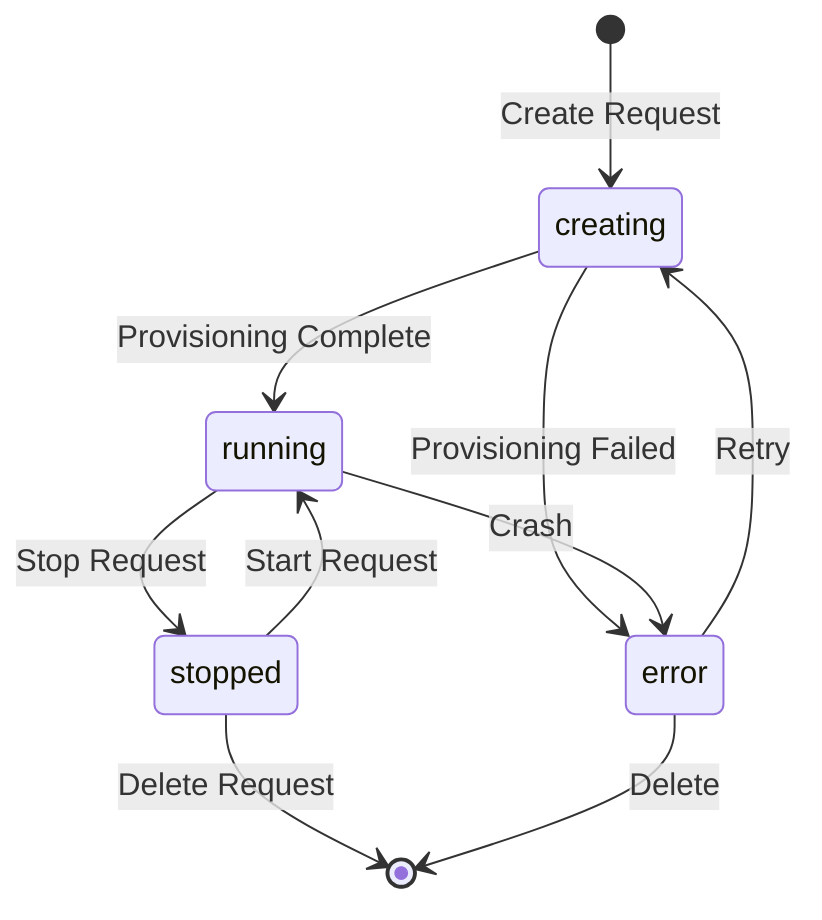

# Pod Lifecycle Management

## Overview

Pod lifecycle management covers the journey from creation to termination, including provisioning, running, and cleanup. The system uses pg-boss for background job processing.

**Implementation:**
- `src/lib/trpc/routers/pods.ts` - API endpoints
- `src/lib/pod-orchestration/pod-provisioning-service.ts` - Provisioning logic
- `src/lib/pod-orchestration/pod-manager.ts` - Container operations

## Lifecycle States

## State Definitions

**Database:** `src/lib/db/schema.ts` (`pods.status` column)

| State | Description | Next States |
|-------|-------------|-------------|
| `creating` | Provisioning container, network, services | `running`, `error` |
| `running` | Container running, services healthy | `stopped`, `error` |
| `stopped` | Container stopped, data preserved | `running`, deleted |
| `error` | Provisioning or runtime failure | `creating` (retry), deleted |

## Provisioning Process

### 1. Pod Creation Request

**Endpoint:** `pods.create` in `src/lib/trpc/routers/pods.ts`

Flow:
1. User submits setup form
2. Validate input via Zod schema
3. Generate `PinacleConfig` via `generatePinacleConfigFromForm()`
4. Create pod record in database:
   - `status = "creating"`
   - `config` = JSON of `PinacleConfig`
   - `envVars` = JSON of environment variables
5. Queue provisioning job via pg-boss

**Job name:** `provision-pod`

### 2. Provisioning Job

**Implementation:** `src/lib/pod-orchestration/pod-provisioning-service.ts`

**Job handler:** Background process picks up job and calls `PodProvisioningService.provisionPod()`

Steps:
1. **Load Configuration**
   - Read pod record from database
   - Parse `PinacleConfig` via `podRecordToPinacleConfig()`
   - Derive resources via `getResourcesFromTier()`

2. **Expand to PodSpec**
   - Load template from registry
   - Expand services from registry
   - Merge environment variables
   - Result: Complete `PodSpec` for orchestration

3. **Provision Infrastructure**
   - Allocate network (subnet, gateway, IP)
   - Allocate external port (30000+)
   - Create Docker network
   - Store in `pods.ports` JSON

4. **Create Container**
   - Pull base image
   - Generate Nginx config (hostname routing)
   - Create gVisor container
   - Mount volumes (`/workspace`, `/data`)
   - Set resource limits (CPU, memory)

5. **Clone Repository**
   - Clone GitHub repo via SSH
   - Checkout specified branch
   - Set up SSH keys for private repos

6. **Provision Services**
   - Install each service via `installScript`
   - Create OpenRC service definitions
   - Start services
   - Verify health checks

7. **Inject pinacle.yaml**
   - Serialize `PinacleConfig` to YAML
   - Write to `/workspace/pinacle.yaml`
   - User can commit to version control

8. **Update Status**
   - `status = "running"`
   - `containerId = <docker-id>`
   - `internalIp = <ip>`
   - `lastStartedAt = now()`

**On failure:**
- `status = "error"`
- Clean up partial resources
- Store error message

### 3. Service Startup

**Implementation:** `src/lib/pod-orchestration/service-provisioner.ts`

For each service:
1. Read service definition from registry
2. Execute installation script
3. Create OpenRC service file
4. Start via `rc-service <name> start`
5. Poll health check until healthy (or timeout)

**Health check types:**
- HTTP: GET request to endpoint
- TCP: Socket connection
- Process: Check if process running

**Timeout:** 2 minutes per service

## Running State

### Container Management

**Implementation:** `src/lib/pod-orchestration/pod-manager.ts`

Operations:
- **Status check**: Query Docker container state
- **Logs**: Stream container logs via `docker logs -f`
- **Execute command**: Run command in container via `docker exec`
- **Restart service**: Restart individual service via OpenRC

### Health Monitoring

**Not yet implemented**

Future: Health checks, metrics collection, automatic restarts

### Updates

**Changing services:**
1. Update `pods.config` JSON
2. Re-inject `pinacle.yaml`
3. Provision new services (if added)
4. Remove old services (if deleted)

**Changing tier:**
1. Update `pods.config` with new tier
2. Restart container with new resource limits
3. Re-inject `pinacle.yaml`

## Stop/Start

### Stop Pod

**Endpoint:** `pods.stop` (not yet implemented)

**Implementation:** `pod-manager.ts` (`stopPod()` method)

Flow:
1. Stop all services via OpenRC
2. Stop container via `docker stop`
3. Update `status = "stopped"`
4. Update `lastStoppedAt = now()`

**Data preserved:**
- Container filesystem
- Network configuration
- Database records

### Start Pod

**Endpoint:** `pods.start` (not yet implemented)

**Implementation:** `pod-manager.ts` (`startPod()` method)

Flow:
1. Start container via `docker start`
2. Start all services via OpenRC
3. Verify health checks
4. Update `status = "running"`
5. Update `lastStartedAt = now()`

## Deletion

### Delete Pod

**Endpoint:** `pods.delete` in `src/lib/trpc/routers/pods.ts`

**Implementation:** `pod-manager.ts` (`destroyPod()` method)

Flow:
1. Stop container (if running)
2. Remove container via `docker rm`
3. Remove network via `docker network rm`
4. Clean up port allocation
5. Delete pod record from database
6. Delete associated logs (`pod_logs` table)

**Data lost:**
- Container filesystem (including `/workspace`)
- Service data
- Logs

**Data preserved:**
- Database metadata (audit trail)
- Snapshots (future feature)

## Error Handling

### Provisioning Errors

**Common failures:**
- Network allocation conflict
- Docker container creation failed
- Service installation failed
- Health check timeout
- GitHub clone failed

**Handling:**
1. Set `status = "error"`
2. Store error message in database
3. Clean up partial resources
4. Allow retry via `pods.retry` endpoint (future)

### Runtime Errors

**Common failures:**
- Container crashed
- Service died
- Out of memory
- Disk full

**Handling:**
1. Set `status = "error"`
2. Store error message
3. Stop other services
4. Notify user (future)
5. Allow manual restart

## Background Jobs

**Implementation:** `src/lib/background-jobs/pods.ts` (future)

**Job types:**
- `provision-pod` - Provision new pod
- `start-pod` - Start stopped pod
- `stop-pod` - Stop running pod
- `delete-pod` - Delete pod and clean up

**Job queue:** pg-boss (PostgreSQL-based)

**Concurrency:** 5 concurrent provisioning jobs per server

**Retries:**
- Automatic: 3 retries with exponential backoff
- Manual: User can retry failed provisioning

## Future Enhancements

**Planned features:**

1. **Hibernation/Snapshots**
   - Snapshot container filesystem
   - Store in S3/MinIO
   - Restore from snapshot
   - Save costs when not in use

2. **Auto-stop**
   - Stop pods after inactivity period
   - Configurable timeout
   - Notify before stopping

3. **Health monitoring**
   - Continuous health checks
   - Automatic service restart
   - Alert on failures

4. **Pod migration**
   - Move pod between servers
   - Zero-downtime migration
   - Load balancing

5. **Rollback**
   - Snapshot before changes
   - Rollback to previous state
   - Config history

## Related Documentation

- [pod-config-representations.md](./pod-config-representations.md) - Configuration architecture
- [13-pod-orchestration-implementation.md](./13-pod-orchestration-implementation.md) - Implementation details
- [09-background-jobs.md](./09-background-jobs.md) - Job processing
- [14-server-management-system.md](./14-server-management-system.md) - Server infrastructure
