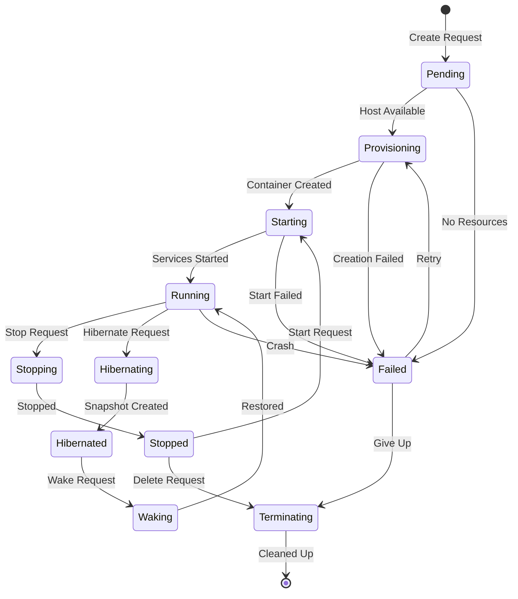

# Pod Lifecycle Management

## Overview

Pod lifecycle management covers the journey from creation to termination, including provisioning, running, hibernation, and cleanup. The system is designed to be simple and reliable, using pg-boss for job processing.

## Lifecycle States



## State Definitions

```typescript
enum PodState {
  PENDING = "pending",           // Awaiting resources
  PROVISIONING = "provisioning", // Creating container
  STARTING = "starting",         // Starting services
  RUNNING = "running",          // Fully operational
  STOPPING = "stopping",        // Stopping services
  STOPPED = "stopped",          // Stopped but not destroyed
  HIBERNATING = "hibernating",  // Creating snapshot
  HIBERNATED = "hibernated",    // Snapshot saved, resources freed
  WAKING = "waking",           // Restoring from snapshot
  FAILED = "failed",           // Error state
  TERMINATING = "terminating", // Cleaning up
}
```

## Provisioning Process

### Simple Pod Creation

```typescript
async function createPod(userId: string, config: CreatePodSpec) {
  // 1. Create pod record
  const pod = await db.pods.create({
    data: {
      id: generateId(),
      name: config.name,
      ownerId: userId,
      tier: config.tier,
      githubRepo: config.repository,
      status: 'pending',
      config,
      createdAt: new Date()
    }
  });

  // 2. Queue provisioning job
  await boss.send('provision-pod', {
    podId: pod.id,
    config
  });

  return pod;
}

async function provisionPod(job: PgBoss.Job) {
  const { podId, config } = job.data;

  try {
    // Update status
    await updatePodStatus(podId, 'provisioning');

    // Pick a host with available resources
    const host = await pickAvailableHost(config.tier);

    // Generate SSH key for GitHub
    const sshKey = await generateSSHKeyPair();

    // Add deploy key to GitHub
    const githubKeyId = await addDeployKey(
      config.repository,
      sshKey.publicKey
    );

    // Store SSH key
    await db.sshKeys.create({
      data: {
        podId,
        publicKey: sshKey.publicKey,
        privateKeyEncrypted: encrypt(sshKey.privateKey),
        githubKeyId
      }
    });

    // Create pod on host (via SSH or HTTP)
    const podInfo = await createPodOnHost(host, podId, config);

    // Update pod with host info
    await db.pods.update({
      where: { id: podId },
      data: {
        hostIp: host.ip,
        internalIp: podInfo.internalIp,
        status: 'starting'
      }
    });

    // Set up services
    await setupServices(podId, config);

    // Clone repository
    await cloneRepository(podId, config.repository, sshKey.privateKey);

    // Start services
    await startServices(podId);

    // Update status to running
    await updatePodStatus(podId, 'running');

  } catch (error) {
    await updatePodStatus(podId, 'failed', error.message);
    throw error; // Let pg-boss retry
  }
}
```

### Host Selection

```typescript
async function pickAvailableHost(tier: string): Promise<Host> {
  // Simple round-robin or least-loaded
  const hosts = await db.hosts.findMany({
    where: { status: 'active' },
    orderBy: { currentPods: 'asc' }
  });

  for (const host of hosts) {
    const available = await checkHostResources(host, tier);
    if (available) {
      // Increment pod count
      await db.hosts.update({
        where: { id: host.id },
        data: { currentPods: { increment: 1 } }
      });
      return host;
    }
  }

  throw new Error('No hosts available');
}
```

## Running State

### Health Monitoring

```typescript
// Simple health check job
await boss.schedule('health-check', '*/5 * * * *', {});

async function checkHealth() {
  const runningPods = await db.pods.findMany({
    where: { status: 'running' }
  });

  for (const pod of runningPods) {
    try {
      const response = await fetch(
        `http://${pod.internalIp}:8080/health`,
        { timeout: 5000 }
      );

      if (!response.ok) {
        // Simple recovery: just restart
        await boss.send('restart-pod', { podId: pod.id });
      }

      await db.pods.update({
        where: { id: pod.id },
        data: { lastHealthCheck: new Date() }
      });

    } catch (error) {
      console.error(`Health check failed for ${pod.id}:`, error);
    }
  }
}
```

## Hibernation

### Hibernate Process

```typescript
async function hibernatePod(podId: string) {
  const pod = await db.pods.findUnique({ where: { id: podId } });
  if (!pod) throw new Error('Pod not found');

  // Update status
  await updatePodStatus(podId, 'hibernating');

  // Create snapshot
  const snapshot = await createSnapshot(pod);

  // Stop and remove pod
  await stopPodOnHost(pod.hostIp, podId);

  // Free up host resources
  await db.hosts.update({
    where: { ip: pod.hostIp },
    data: { currentPods: { decrement: 1 } }
  });

  // Update pod status
  await db.pods.update({
    where: { id: podId },
    data: {
      status: 'hibernated',
      hibernatedAt: new Date(),
      lastSnapshotId: snapshot.id,
      hostIp: null,
      internalIp: null
    }
  });
}
```

### Wake Process

```typescript
async function wakePod(podId: string) {
  const pod = await db.pods.findUnique({
    where: { id: podId },
    include: { lastSnapshot: true }
  });

  if (!pod.lastSnapshot) {
    throw new Error('No snapshot available');
  }

  // Update status
  await updatePodStatus(podId, 'waking');

  // Find new host
  const host = await pickAvailableHost(pod.tier);

  // Create pod on host
  const podInfo = await createPodOnHost(host, podId, pod.config);

  // Restore from snapshot
  await restoreSnapshot(pod.lastSnapshot, podInfo);

  // Update pod
  await db.pods.update({
    where: { id: podId },
    data: {
      status: 'running',
      hostIp: host.ip,
      internalIp: podInfo.internalIp,
      wokeAt: new Date()
    }
  });
}
```

## Termination

### Cleanup Process

```typescript
async function terminatePod(podId: string) {
  const pod = await db.pods.findUnique({
    where: { id: podId },
    include: { sshKeys: true }
  });

  if (!pod) return;

  // Update status
  await updatePodStatus(podId, 'terminating');

  // Remove from host if running
  if (pod.hostIp) {
    await removePodFromHost(pod.hostIp, podId);

    // Free up host resources
    await db.hosts.update({
      where: { ip: pod.hostIp },
      data: { currentPods: { decrement: 1 } }
    });
  }

  // Remove GitHub deploy keys
  for (const key of pod.sshKeys) {
    if (key.githubKeyId) {
      await removeGitHubDeployKey(key.githubKeyId);
    }
  }

  // Delete snapshots from S3
  const snapshots = await db.snapshots.findMany({
    where: { podId }
  });

  for (const snapshot of snapshots) {
    await deleteFromS3(snapshot.storageUrl);
  }

  // Delete pod record (cascades to related tables)
  await db.pods.delete({ where: { id: podId } });
}
```

## Error Handling

### Simple Retry Logic

```typescript
// pg-boss handles retries automatically
const boss = new PgBoss({
  retryLimit: 3,
  retryDelay: 60,      // seconds
  retryBackoff: true,  // exponential backoff
});

// In job handlers
async function provisionPod(job: PgBoss.Job) {
  const { podId } = job.data;

  try {
    // ... provisioning logic
  } catch (error) {
    // Log error
    console.error(`Failed to provision pod ${podId}:`, error);

    // Update pod status
    await db.pods.update({
      where: { id: podId },
      data: {
        status: 'failed',
        error: error.message
      }
    });

    // Check if should retry
    if (job.retryCount < 3 && isRetryableError(error)) {
      throw error; // pg-boss will retry
    }

    // Give up - notify user
    await notifyUser(podId, 'Pod provisioning failed');
  }
}

function isRetryableError(error: Error): boolean {
  // Network errors are retryable
  if (error.message.includes('ECONNREFUSED')) return true;
  if (error.message.includes('ETIMEDOUT')) return true;

  // Resource issues might resolve
  if (error.message.includes('No hosts available')) return true;

  // Configuration errors are not retryable
  if (error.message.includes('Invalid configuration')) return false;
  if (error.message.includes('GitHub repository not found')) return false;

  return true;
}
```

## Lifecycle Events

### Simple Event System

```typescript
// Just log important events
async function logPodEvent(
  podId: string,
  event: string,
  metadata?: any
) {
  await db.podEvents.create({
    data: {
      podId,
      event,
      metadata,
      timestamp: new Date()
    }
  });
}

// Usage
await logPodEvent(podId, 'provisioning_started');
await logPodEvent(podId, 'services_started', { services: ['vibe-kanban', 'claude-code'] });
await logPodEvent(podId, 'snapshot_created', { snapshotId, size });
```

## Resource Limits

### Simple Resource Management

```typescript
const resourceLimits = {
  'dev.small': {
    cpu: '500m',      // 0.5 CPU
    memory: '1Gi',    // 1 GB RAM
    storage: '10Gi',  // 10 GB disk
  },
  'dev.medium': {
    cpu: '1000m',     // 1 CPU
    memory: '2Gi',    // 2 GB RAM
    storage: '20Gi',  // 20 GB disk
  },
  'dev.large': {
    cpu: '2000m',     // 2 CPUs
    memory: '4Gi',    // 4 GB RAM
    storage: '40Gi',  // 40 GB disk
  },
  'dev.xlarge': {
    cpu: '4000m',     // 4 CPUs
    memory: '8Gi',    // 8 GB RAM
    storage: '80Gi',  // 80 GB disk
  }
};

// Apply limits when creating container
async function createContainer(podId: string, tier: string) {
  const limits = resourceLimits[tier];

  return await docker.createContainer({
    name: `pod-${podId}`,
    Image: 'ubuntu:22.04',
    HostConfig: {
      Runtime: 'runsc',  // gVisor
      Memory: parseMemory(limits.memory),
      CpuQuota: parseCpu(limits.cpu) * 100000,
      CpuPeriod: 100000,
      StorageOpt: {
        size: limits.storage
      }
    }
  });
}
```