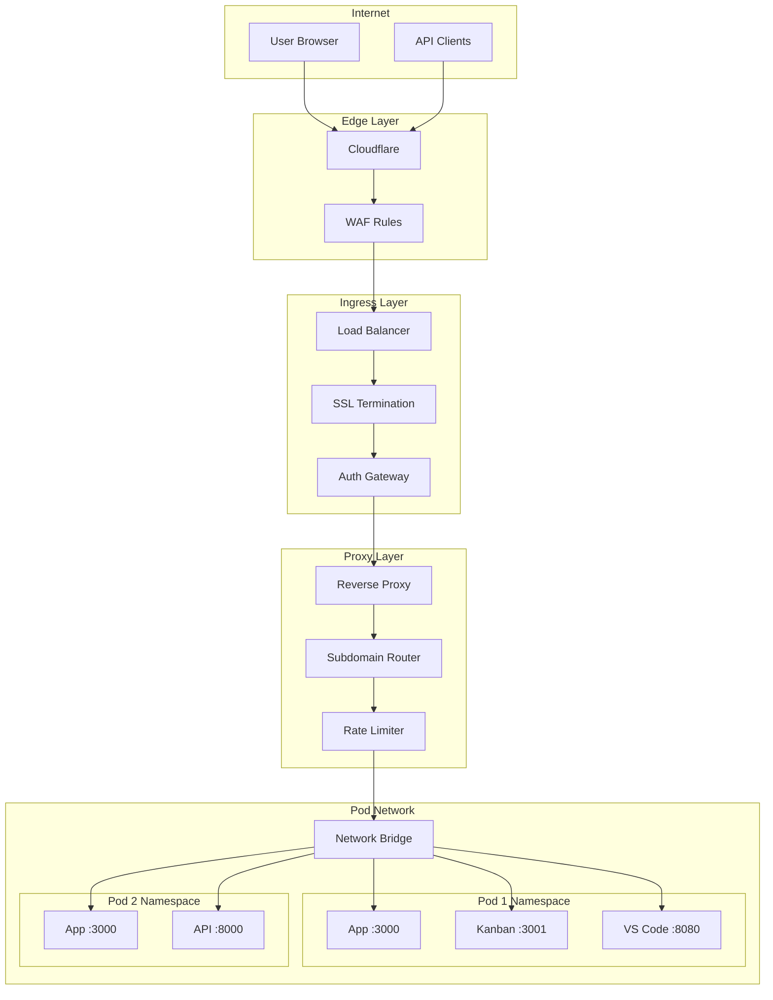

# Networking and Port Exposure Architecture

## Overview

The networking architecture provides secure, authenticated access to pod services through a sophisticated proxy system with subdomain-based routing, SSL termination, and built-in authentication. Each pod operates in an isolated network namespace with controlled ingress/egress.

## Network Architecture Diagram



## Subdomain Routing Strategy

### URL Structure

```
https://{service}-{pod}-{user}.pinacle.dev
```

Examples:
- `https://app-myproject-john.pinacle.dev` → User's application
- `https://kanban-myproject-john.pinacle.dev` → Vibe Kanban
- `https://code-myproject-john.pinacle.dev` → VS Code Server
- `https://api-myproject-john.pinacle.dev` → API endpoint

### DNS Configuration

```typescript
class DNSManager {
  async configurePodDNS(pod: Pod, ports: PortConfig[]): Promise<void> {
    for (const port of ports) {
      const subdomain = this.generateSubdomain(pod, port);

      // Create DNS record
      await this.createDNSRecord({
        type: 'CNAME',
        name: subdomain,
        value: 'proxy.pinacle.dev',
        ttl: 300,
        proxied: true  // Cloudflare proxy
      });

      // Store mapping
      await db.podRoutes.create({
        data: {
          podId: pod.id,
          subdomain,
          internalPort: port.internal,
          externalPort: port.external,
          serviceName: port.name,
          requiresAuth: port.auth ?? true,
          isPublic: port.public ?? false
        }
      });
    }
  }

  private generateSubdomain(pod: Pod, port: PortConfig): string {
    const user = pod.owner.username;
    const podName = pod.name.toLowerCase().replace(/[^a-z0-9]/g, '-');
    const service = port.name.toLowerCase();

    return `${service}-${podName}-${user}`;
  }
}
```

## Reverse Proxy Implementation

### Nginx Configuration

```nginx
# /etc/nginx/sites-available/pinacle-proxy

# Upstream for pod services
upstream pod_services {
    least_conn;
    server pod-host-1.internal:8080;
    server pod-host-2.internal:8080;
    server pod-host-3.internal:8080;
}

# Wildcard SSL certificate
server {
    listen 443 ssl http2;
    server_name *.pinacle.dev;

    ssl_certificate /etc/ssl/pinacle.dev/fullchain.pem;
    ssl_certificate_key /etc/ssl/pinacle.dev/privkey.pem;

    # Extract subdomain components
    set $service '';
    set $pod '';
    set $user '';

    if ($host ~* ^([^-]+)-([^-]+)-([^.]+)\.pinacle\.dev$) {
        set $service $1;
        set $pod $2;
        set $user $3;
    }

    # Authentication check
    location @auth {
        internal;
        proxy_pass http://auth-service/verify;
        proxy_pass_request_body off;
        proxy_set_header Content-Length "";
        proxy_set_header X-Original-URI $request_uri;
        proxy_set_header X-Service $service;
        proxy_set_header X-Pod $pod;
        proxy_set_header X-User $user;
    }

    # Main proxy
    location / {
        # Check authentication
        auth_request @auth;
        auth_request_set $auth_status $upstream_status;
        auth_request_set $pod_ip $upstream_http_x_pod_ip;
        auth_request_set $pod_port $upstream_http_x_pod_port;

        # WebSocket support
        proxy_http_version 1.1;
        proxy_set_header Upgrade $http_upgrade;
        proxy_set_header Connection $connection_upgrade;

        # Standard headers
        proxy_set_header Host $host;
        proxy_set_header X-Real-IP $remote_addr;
        proxy_set_header X-Forwarded-For $proxy_add_x_forwarded_for;
        proxy_set_header X-Forwarded-Proto $scheme;

        # Proxy to pod
        proxy_pass http://$pod_ip:$pod_port;

        # Timeouts
        proxy_connect_timeout 60s;
        proxy_send_timeout 60s;
        proxy_read_timeout 60s;

        # Buffering
        proxy_buffering off;
        proxy_request_buffering off;
    }
}
```

### Dynamic Proxy Service

```typescript
class ProxyService {
  private routes: Map<string, RouteConfig> = new Map();

  async handleRequest(req: Request): Promise<Response> {
    const { service, pod, user } = this.parseSubdomain(req.hostname);

    // Get route configuration
    const route = await this.getRoute(service, pod, user);

    if (!route) {
      return new Response('Service not found', { status: 404 });
    }

    // Check authentication if required
    if (route.requiresAuth && !route.isPublic) {
      const isAuthenticated = await this.authenticate(req, route);
      if (!isAuthenticated) {
        return new Response('Unauthorized', { status: 401 });
      }
    }

    // Apply rate limiting
    const rateLimitOk = await this.checkRateLimit(req, route);
    if (!rateLimitOk) {
      return new Response('Rate limit exceeded', { status: 429 });
    }

    // Proxy the request
    return this.proxyRequest(req, route);
  }

  private async proxyRequest(req: Request, route: RouteConfig): Promise<Response> {
    const targetUrl = `http://${route.podIp}:${route.internalPort}${req.path}`;

    const proxyReq = new Request(targetUrl, {
      method: req.method,
      headers: this.prepareHeaders(req.headers, route),
      body: req.body
    });

    try {
      const response = await fetch(proxyReq);

      // Handle WebSocket upgrade
      if (response.headers.get('upgrade') === 'websocket') {
        return this.handleWebSocket(req, route);
      }

      return response;
    } catch (error) {
      console.error('Proxy error:', error);
      return new Response('Service unavailable', { status: 503 });
    }
  }

  private prepareHeaders(headers: Headers, route: RouteConfig): Headers {
    const newHeaders = new Headers(headers);

    // Remove hop-by-hop headers
    ['connection', 'keep-alive', 'proxy-authenticate', 'proxy-authorization',
     'te', 'trailers', 'transfer-encoding', 'upgrade'].forEach(h => {
      newHeaders.delete(h);
    });

    // Add forwarding headers
    newHeaders.set('X-Forwarded-For', headers.get('x-real-ip') || '');
    newHeaders.set('X-Forwarded-Proto', 'https');
    newHeaders.set('X-Forwarded-Host', headers.get('host') || '');

    // Add pod context
    newHeaders.set('X-Pod-Id', route.podId);
    newHeaders.set('X-Pod-User', route.userId);

    return newHeaders;
  }
}
```

## Authentication Gateway

### Auth Flow

```typescript
class AuthGateway {
  async verifyAccess(req: AuthRequest): Promise<AuthResponse> {
    const { service, pod, user } = req;

    // Get route configuration
    const route = await db.podRoutes.findFirst({
      where: {
        pod: { name: pod, owner: { username: user } },
        serviceName: service
      },
      include: {
        pod: {
          include: {
            owner: true,
            team: {
              include: {
                members: true
              }
            }
          }
        }
      }
    });

    if (!route) {
      return { authorized: false, reason: 'Route not found' };
    }

    // Public routes bypass auth
    if (route.isPublic) {
      return {
        authorized: true,
        podIp: route.pod.internalIp,
        podPort: route.internalPort
      };
    }

    // Extract auth token
    const token = this.extractToken(req);
    if (!token) {
      return { authorized: false, reason: 'No token provided' };
    }

    // Verify JWT
    const payload = await this.verifyJWT(token);
    if (!payload) {
      return { authorized: false, reason: 'Invalid token' };
    }

    // Check access permissions
    const hasAccess = await this.checkAccess(payload.userId, route.pod);
    if (!hasAccess) {
      return { authorized: false, reason: 'Access denied' };
    }

    return {
      authorized: true,
      podIp: route.pod.internalIp,
      podPort: route.internalPort,
      userId: payload.userId
    };
  }

  private async checkAccess(userId: string, pod: Pod): Promise<boolean> {
    // Owner has access
    if (pod.ownerId === userId) {
      return true;
    }

    // Team members have access
    if (pod.teamId) {
      const isMember = await db.teamMembers.findFirst({
        where: {
          teamId: pod.teamId,
          userId,
          status: 'active'
        }
      });

      if (isMember) {
        return true;
      }
    }

    // Check for shared access
    const sharedAccess = await db.podShares.findFirst({
      where: {
        podId: pod.id,
        userId,
        expiresAt: { gt: new Date() }
      }
    });

    return !!sharedAccess;
  }
}
```

## Network Isolation

### Pod Network Namespace

```bash
#!/bin/bash
# setup-pod-network.sh

POD_ID=$1
VETH_NAME="veth-${POD_ID:0:8}"
POD_IP="10.100.${POD_SUBNET}.2"
GATEWAY_IP="10.100.${POD_SUBNET}.1"

# Create network namespace
ip netns add pod-$POD_ID

# Create veth pair
ip link add $VETH_NAME type veth peer name eth0 netns pod-$POD_ID

# Configure host side
ip addr add $GATEWAY_IP/24 dev $VETH_NAME
ip link set $VETH_NAME up

# Configure pod side
ip netns exec pod-$POD_ID ip addr add $POD_IP/24 dev eth0
ip netns exec pod-$POD_ID ip link set eth0 up
ip netns exec pod-$POD_ID ip link set lo up
ip netns exec pod-$POD_ID ip route add default via $GATEWAY_IP

# Enable NAT
iptables -t nat -A POSTROUTING -s $POD_IP/32 -j MASQUERADE
iptables -A FORWARD -i $VETH_NAME -j ACCEPT
iptables -A FORWARD -o $VETH_NAME -m state --state RELATED,ESTABLISHED -j ACCEPT

# Apply network policies
./apply-network-policies.sh $POD_ID $POD_IP
```

### Network Policies

```typescript
class NetworkPolicyManager {
  async applyPolicies(pod: Pod): Promise<void> {
    const policies = await this.getPolicies(pod);

    for (const policy of policies) {
      await this.applyPolicy(pod, policy);
    }
  }

  private async applyPolicy(pod: Pod, policy: NetworkPolicy): Promise<void> {
    switch (policy.type) {
      case 'egress':
        await this.applyEgressPolicy(pod, policy);
        break;
      case 'ingress':
        await this.applyIngressPolicy(pod, policy);
        break;
      case 'bandwidth':
        await this.applyBandwidthPolicy(pod, policy);
        break;
    }
  }

  private async applyEgressPolicy(pod: Pod, policy: EgressPolicy): Promise<void> {
    const script = `
      # Default deny all egress
      iptables -A OUTPUT -m owner --uid-owner ${pod.uid} -j DROP

      # Allow DNS
      iptables -I OUTPUT -m owner --uid-owner ${pod.uid} -p udp --dport 53 -j ACCEPT
      iptables -I OUTPUT -m owner --uid-owner ${pod.uid} -p tcp --dport 53 -j ACCEPT

      # Allow HTTPS to specific domains
      ${policy.allowedDomains.map(domain => `
        iptables -I OUTPUT -m owner --uid-owner ${pod.uid} -d ${domain} -p tcp --dport 443 -j ACCEPT
      `).join('\n')}

      # Allow internal services
      iptables -I OUTPUT -m owner --uid-owner ${pod.uid} -d 10.0.0.0/8 -j ACCEPT
    `;

    await this.executeScript(pod, script);
  }

  private async applyBandwidthPolicy(pod: Pod, policy: BandwidthPolicy): Promise<void> {
    const script = `
      # Apply traffic control
      tc qdisc add dev eth0 root handle 1: htb default 30

      # Set bandwidth limits
      tc class add dev eth0 parent 1: classid 1:1 htb rate ${policy.maxBandwidth}mbit
      tc class add dev eth0 parent 1:1 classid 1:10 htb rate ${policy.guaranteedBandwidth}mbit ceil ${policy.maxBandwidth}mbit

      # Apply to pod traffic
      tc filter add dev eth0 protocol ip parent 1:0 prio 1 u32 match ip src ${pod.ip}/32 flowid 1:10
    `;

    await this.executeScript(pod, script);
  }
}
```

## Port Management

### Port Allocation

```typescript
class PortAllocator {
  private allocatedPorts: Set<number> = new Set();
  private portRange = { min: 30000, max: 40000 };

  async allocatePort(pod: Pod, service: string): Promise<number> {
    // Try to find an available port
    for (let port = this.portRange.min; port <= this.portRange.max; port++) {
      if (!this.allocatedPorts.has(port)) {
        // Check if port is actually available
        const isAvailable = await this.checkPortAvailable(port);
        if (isAvailable) {
          this.allocatedPorts.add(port);

          // Store allocation
          await db.portAllocations.create({
            data: {
              podId: pod.id,
              service,
              port,
              allocatedAt: new Date()
            }
          });

          return port;
        }
      }
    }

    throw new Error('No available ports');
  }

  async releasePort(pod: Pod, port: number): Promise<void> {
    this.allocatedPorts.delete(port);

    await db.portAllocations.deleteMany({
      where: {
        podId: pod.id,
        port
      }
    });
  }

  private async checkPortAvailable(port: number): Promise<boolean> {
    return new Promise((resolve) => {
      const server = net.createServer();

      server.once('error', () => resolve(false));
      server.once('listening', () => {
        server.close();
        resolve(true);
      });

      server.listen(port);
    });
  }
}
```

### Port Forwarding

```typescript
class PortForwarder {
  async setupForwarding(pod: Pod, mapping: PortMapping): Promise<void> {
    const { internalPort, externalPort, protocol = 'tcp' } = mapping;

    // iptables rules for port forwarding
    const rules = [
      // DNAT for incoming traffic
      `iptables -t nat -A PREROUTING -p ${protocol} --dport ${externalPort} -j DNAT --to-destination ${pod.ip}:${internalPort}`,

      // Allow forwarded traffic
      `iptables -A FORWARD -p ${protocol} -d ${pod.ip} --dport ${internalPort} -m state --state NEW,ESTABLISHED,RELATED -j ACCEPT`,

      // SNAT for return traffic
      `iptables -t nat -A POSTROUTING -p ${protocol} -s ${pod.ip} --sport ${internalPort} -j SNAT --to-source ${pod.hostIp}:${externalPort}`
    ];

    for (const rule of rules) {
      await this.executeCommand(rule);
    }

    // Store forwarding rule
    await db.portForwards.create({
      data: {
        podId: pod.id,
        internalPort,
        externalPort,
        protocol,
        createdAt: new Date()
      }
    });
  }

  async removeForwarding(pod: Pod, mapping: PortMapping): Promise<void> {
    const { internalPort, externalPort, protocol = 'tcp' } = mapping;

    // Remove iptables rules
    const rules = [
      `iptables -t nat -D PREROUTING -p ${protocol} --dport ${externalPort} -j DNAT --to-destination ${pod.ip}:${internalPort}`,
      `iptables -D FORWARD -p ${protocol} -d ${pod.ip} --dport ${internalPort} -m state --state NEW,ESTABLISHED,RELATED -j ACCEPT`,
      `iptables -t nat -D POSTROUTING -p ${protocol} -s ${pod.ip} --sport ${internalPort} -j SNAT --to-source ${pod.hostIp}:${externalPort}`
    ];

    for (const rule of rules) {
      await this.executeCommand(rule);
    }

    // Remove from database
    await db.portForwards.deleteMany({
      where: {
        podId: pod.id,
        internalPort,
        externalPort
      }
    });
  }
}
```

## SSL/TLS Management

### Certificate Management

```typescript
class CertificateManager {
  async setupSSL(subdomain: string): Promise<void> {
    // Using Let's Encrypt with Certbot
    const cert = await this.obtainCertificate(subdomain);

    // Store certificate
    await db.certificates.create({
      data: {
        domain: subdomain,
        certificate: cert.certificate,
        privateKey: await this.encrypt(cert.privateKey),
        chain: cert.chain,
        expiresAt: cert.expiresAt
      }
    });

    // Configure nginx
    await this.updateNginxConfig(subdomain, cert);

    // Reload nginx
    await this.reloadNginx();
  }

  private async obtainCertificate(domain: string): Promise<Certificate> {
    const command = `
      certbot certonly \
        --nginx \
        --non-interactive \
        --agree-tos \
        --email admin@pinacle.dev \
        --domains ${domain}
    `;

    await this.executeCommand(command);

    return {
      certificate: await fs.readFile(`/etc/letsencrypt/live/${domain}/cert.pem`),
      privateKey: await fs.readFile(`/etc/letsencrypt/live/${domain}/privkey.pem`),
      chain: await fs.readFile(`/etc/letsencrypt/live/${domain}/chain.pem`),
      expiresAt: new Date(Date.now() + 90 * 24 * 60 * 60 * 1000) // 90 days
    };
  }
}
```

## Rate Limiting

### Implementation

```typescript
class RateLimiter {
  private limits: Map<string, RateLimit> = new Map();

  async checkLimit(req: Request, route: RouteConfig): Promise<boolean> {
    const key = this.getLimitKey(req, route);
    const limit = await this.getLimit(key);

    // Check if limit exceeded
    if (limit.count >= limit.max) {
      // Check if window has passed
      const windowElapsed = Date.now() - limit.windowStart > limit.windowMs;
      if (!windowElapsed) {
        return false; // Rate limit exceeded
      }

      // Reset window
      limit.count = 0;
      limit.windowStart = Date.now();
    }

    // Increment counter
    limit.count++;
    await this.saveLimit(key, limit);

    return true;
  }

  private getLimitKey(req: Request, route: RouteConfig): string {
    // Different limits for different scenarios
    if (route.isPublic) {
      // IP-based limiting for public routes
      return `public:${req.ip}`;
    } else {
      // User-based limiting for authenticated routes
      return `user:${route.userId}`;
    }
  }

  private async getLimit(key: string): Promise<RateLimit> {
    const cached = await redis.get(`ratelimit:${key}`);
    if (cached) {
      return JSON.parse(cached);
    }

    // Default limits based on key type
    const [type] = key.split(':');
    switch (type) {
      case 'public':
        return {
          max: 100,
          windowMs: 60000, // 1 minute
          count: 0,
          windowStart: Date.now()
        };
      case 'user':
        return {
          max: 1000,
          windowMs: 60000, // 1 minute
          count: 0,
          windowStart: Date.now()
        };
      default:
        return {
          max: 50,
          windowMs: 60000,
          count: 0,
          windowStart: Date.now()
        };
    }
  }
}
```

## Monitoring and Metrics

### Network Metrics

```typescript
class NetworkMonitor {
  async collectMetrics(pod: Pod): Promise<NetworkMetrics> {
    const stats = await this.getNetworkStats(pod);

    return {
      bandwidth: {
        inbound: stats.rx_bytes_per_sec,
        outbound: stats.tx_bytes_per_sec,
        total: stats.rx_bytes_per_sec + stats.tx_bytes_per_sec
      },
      packets: {
        received: stats.rx_packets,
        transmitted: stats.tx_packets,
        dropped: stats.rx_dropped + stats.tx_dropped,
        errors: stats.rx_errors + stats.tx_errors
      },
      connections: {
        active: stats.active_connections,
        established: stats.established_connections,
        timeWait: stats.time_wait_connections
      },
      latency: {
        p50: stats.latency_p50,
        p95: stats.latency_p95,
        p99: stats.latency_p99
      }
    };
  }
}
```
