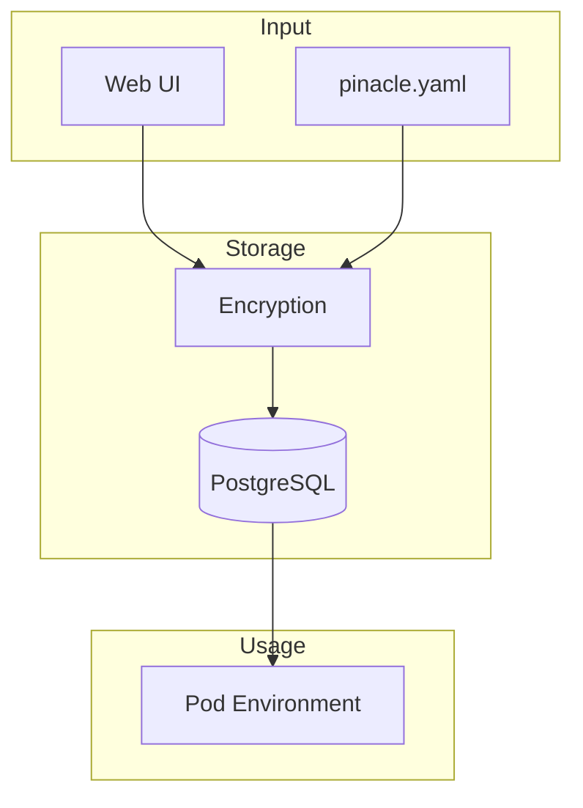

# Secrets and Environment Variables Management

## Overview

The secrets management system provides simple, secure storage for API keys and environment variables. Secrets are encrypted in the database and automatically injected into pods. No complex features - just what we need for the MVP.

## Simple Architecture



## Database Schema

```sql
CREATE TABLE secrets (
  id UUID PRIMARY KEY,
  name VARCHAR(255) NOT NULL,
  value_encrypted TEXT NOT NULL,
  owner_id UUID REFERENCES users(id),
  project_ref VARCHAR(500),  -- GitHub repo URL
  created_at TIMESTAMP DEFAULT NOW(),

  UNIQUE(owner_id, project_ref, name)
);
```

## Encryption

### Simple Encryption

```typescript
import crypto from 'crypto';

class SecretManager {
  private encryptionKey: Buffer;

  constructor() {
    // Use environment variable or generate
    this.encryptionKey = Buffer.from(
      process.env.ENCRYPTION_KEY || crypto.randomBytes(32).toString('hex'),
      'hex'
    );
  }

  encrypt(value: string): string {
    const iv = crypto.randomBytes(16);
    const cipher = crypto.createCipheriv(
      'aes-256-gcm',
      this.encryptionKey,
      iv
    );

    const encrypted = Buffer.concat([
      cipher.update(value, 'utf8'),
      cipher.final()
    ]);

    const authTag = cipher.getAuthTag();

    // Combine iv, authTag, and encrypted data
    return JSON.stringify({
      iv: iv.toString('base64'),
      authTag: authTag.toString('base64'),
      data: encrypted.toString('base64')
    });
  }

  decrypt(encryptedValue: string): string {
    const { iv, authTag, data } = JSON.parse(encryptedValue);

    const decipher = crypto.createDecipheriv(
      'aes-256-gcm',
      this.encryptionKey,
      Buffer.from(iv, 'base64')
    );

    decipher.setAuthTag(Buffer.from(authTag, 'base64'));

    const decrypted = Buffer.concat([
      decipher.update(Buffer.from(data, 'base64')),
      decipher.final()
    ]);

    return decrypted.toString('utf8');
  }
}
```

## Secret Management

### Saving Secrets

```typescript
// Save secret for a project
app.post('/api/secrets', async (req, res) => {
  const { name, value, projectRef } = req.body;
  const userId = req.session.user.id;

  const encrypted = secretManager.encrypt(value);

  await db.secrets.upsert({
    where: {
      owner_id_project_ref_name: {
        owner_id: userId,
        project_ref: projectRef,
        name
      }
    },
    update: {
      value_encrypted: encrypted
    },
    create: {
      id: generateId(),
      name,
      value_encrypted: encrypted,
      owner_id: userId,
      project_ref: projectRef
    }
  });

  res.json({ success: true });
});

// Get secrets for a project
app.get('/api/secrets', async (req, res) => {
  const { projectRef } = req.query;
  const userId = req.session.user.id;

  const secrets = await db.secrets.findMany({
    where: {
      owner_id: userId,
      project_ref: projectRef
    },
    select: {
      id: true,
      name: true,
      created_at: true
      // Don't send values to frontend
    }
  });

  res.json(secrets);
});
```

### Injecting into Pods

```typescript
async function injectSecrets(podId: string, projectRef: string) {
  const pod = await db.pods.findUnique({
    where: { id: podId },
    include: { owner: true }
  });

  // Get secrets for this project
  const secrets = await db.secrets.findMany({
    where: {
      owner_id: pod.ownerId,
      project_ref: projectRef
    }
  });

  // Decrypt and format as env vars
  const envVars: Record<string, string> = {};

  for (const secret of secrets) {
    envVars[secret.name] = secretManager.decrypt(secret.value_encrypted);
  }

  // Also add default env vars
  envVars.POD_ID = podId;
  envVars.POD_NAME = pod.name;
  envVars.POD_TIER = pod.tier;

  // Write to pod
  await writeToPod(podId, '/workspace/.env', formatEnvFile(envVars));

  // Export in bash profile
  await execInPod(podId, `
    echo 'set -a; source /workspace/.env; set +a' >> ~/.bashrc
  `);
}

function formatEnvFile(vars: Record<string, string>): string {
  return Object.entries(vars)
    .map(([key, value]) => `${key}="${value}"`)
    .join('\n');
}
```

## Project-Based Secrets

### Automatic Linking

When creating a new pod for a project, automatically use existing secrets:

```typescript
async function linkProjectSecrets(podId: string, repository: string) {
  const pod = await db.pods.findUnique({ where: { id: podId } });

  // Check if we have secrets for this project
  const secrets = await db.secrets.findMany({
    where: {
      owner_id: pod.ownerId,
      project_ref: repository
    }
  });

  if (secrets.length > 0) {
    // Inject existing secrets
    await injectSecrets(podId, repository);
  } else {
    // First time - prompt for required secrets
    const config = await loadPinacleYaml(repository);

    if (config?.environment?.required) {
      // Return required secrets to frontend
      return {
        needsSecrets: true,
        required: config.environment.required
      };
    }
  }
}
```

## Configuration File Support

### pinacle.yaml

```yaml
# Example pinacle.yaml in user's repo
environment:
  required:
    - name: ANTHROPIC_API_KEY
      description: "API key for Claude"
    - name: DATABASE_URL
      description: "PostgreSQL connection string"

  optional:
    NODE_ENV: development
    PORT: 3000
```

### Loading Configuration

```typescript
async function loadPodConfig(repository: string): Promise<PodConfig> {
  // Try to fetch pinacle.yaml from repo
  const config = await fetchFileFromGitHub(
    repository,
    'pinacle.yaml'
  );

  if (config) {
    return parseYaml(config);
  }

  // No config - use defaults
  return {
    environment: {
      required: [],
      optional: {}
    }
  };
}
```

## UI for Secrets

### Simple Secret Form

```tsx
const SecretForm: React.FC<{ projectRef: string }> = ({ projectRef }) => {
  const [secrets, setSecrets] = useState<Secret[]>([]);

  const handleAddSecret = async (name: string, value: string) => {
    await fetch('/api/secrets', {
      method: 'POST',
      body: JSON.stringify({
        name,
        value,
        projectRef
      })
    });

    // Refresh list
    await loadSecrets();
  };

  return (
    <div className="space-y-4">
      <h3>Environment Variables</h3>

      {/* List existing secrets */}
      {secrets.map(secret => (
        <div key={secret.id} className="flex justify-between">
          <span>{secret.name}</span>
          <Button onClick={() => deleteSecret(secret.id)}>
            Delete
          </Button>
        </div>
      ))}

      {/* Add new secret */}
      <div className="flex gap-2">
        <Input
          placeholder="Variable name"
          value={name}
          onChange={(e) => setName(e.target.value)}
        />
        <Input
          type="password"
          placeholder="Value"
          value={value}
          onChange={(e) => setValue(e.target.value)}
        />
        <Button onClick={() => handleAddSecret(name, value)}>
          Add
        </Button>
      </div>
    </div>
  );
};
```

## Security Considerations

### What We Do
- ✅ Encrypt secrets at rest
- ✅ Use HTTPS everywhere
- ✅ Scope secrets to user/project
- ✅ Don't log secret values

### What We Don't Do (Yet)
- ❌ No key rotation
- ❌ No audit logging
- ❌ No versioning
- ❌ No team-based access control
- ❌ No HSM/KMS integration

## Common Secrets

### Pre-configured Templates

```typescript
const commonSecrets = {
  'nextjs': [
    { name: 'DATABASE_URL', description: 'Database connection' },
    { name: 'NEXTAUTH_SECRET', description: 'NextAuth secret' },
    { name: 'NEXTAUTH_URL', description: 'App URL' }
  ],

  'ai-app': [
    { name: 'ANTHROPIC_API_KEY', description: 'Claude API key' },
    { name: 'OPENAI_API_KEY', description: 'OpenAI API key' }
  ],

  'django': [
    { name: 'SECRET_KEY', description: 'Django secret key' },
    { name: 'DATABASE_URL', description: 'Database connection' },
    { name: 'DEBUG', description: 'Debug mode' }
  ]
};

// Suggest secrets based on template
function suggestSecrets(template: string): SecretTemplate[] {
  return commonSecrets[template] || [];
}
```

## Limitations

This is a simple MVP implementation:

1. **No Complex Features**: Just basic secret storage and injection
2. **Single Encryption Key**: One key for all secrets (rotate manually)
3. **No Versioning**: Updating overwrites the previous value
4. **No Sharing**: Secrets are per-user, not per-team
5. **Manual Management**: No automatic detection or validation

These limitations are acceptable for MVP and can be enhanced later as needed.