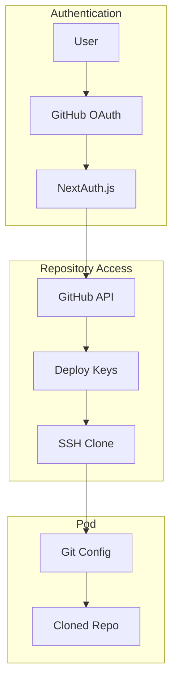

# GitHub Integration and SSH Key Management

## Overview

Simple GitHub integration for authentication and repository access. We use OAuth for login and generate SSH deploy keys for each pod to clone repositories. No complex features - just what works.

## Architecture



## GitHub OAuth

### Simple NextAuth Configuration

```typescript
// lib/auth.ts
import NextAuth from "next-auth";
import GitHubProvider from "next-auth/providers/github";

export const authOptions = {
  providers: [
    GitHubProvider({
      clientId: process.env.GITHUB_CLIENT_ID!,
      clientSecret: process.env.GITHUB_CLIENT_SECRET!,
      authorization: {
        params: {
          scope: 'read:user user:email repo admin:public_key'
        }
      }
    })
  ],

  callbacks: {
    async session({ session, token }) {
      // Store GitHub access token
      session.accessToken = token.accessToken;
      session.githubId = token.githubId;
      return session;
    },

    async jwt({ token, account, profile }) {
      if (account) {
        token.accessToken = account.access_token;
        token.githubId = profile?.id;
      }
      return token;
    }
  }
};
```

### User Login Flow

```typescript
// Simple login - just GitHub
app.get('/auth/signin', (req, res) => {
  res.redirect('/api/auth/signin/github');
});

// After login, create/update user
async function handleGitHubLogin(profile: GitHubProfile) {
  const user = await db.users.upsert({
    where: { githubId: profile.id },
    update: {
      email: profile.email,
      githubUsername: profile.login,
      avatarUrl: profile.avatar_url
    },
    create: {
      id: generateId(),
      githubId: profile.id,
      email: profile.email,
      githubUsername: profile.login,
      avatarUrl: profile.avatar_url
    }
  });

  return user;
}
```

## Repository Access

### List User Repositories

```typescript
async function getUserRepositories(accessToken: string) {
  const octokit = new Octokit({ auth: accessToken });

  // Get user's repos
  const { data: repos } = await octokit.repos.listForAuthenticatedUser({
    sort: 'updated',
    per_page: 100
  });

  // Simple format
  return repos.map(repo => ({
    id: repo.id,
    name: repo.name,
    fullName: repo.full_name,
    private: repo.private,
    url: repo.html_url,
    cloneUrl: repo.ssh_url,
    defaultBranch: repo.default_branch
  }));
}
```

## SSH Key Management

### Generate SSH Key for Pod

```typescript
import { generateKeyPairSync } from 'crypto';
import sshpk from 'sshpk';

function generateSSHKeyPair(): SSHKeyPair {
  // Generate Ed25519 key (modern and fast)
  const { publicKey, privateKey } = generateKeyPairSync('ed25519');

  // Convert to SSH format
  const sshPublicKey = sshpk.parseKey(publicKey, 'pem');
  const sshPrivateKey = sshpk.parseKey(privateKey, 'pem');

  return {
    publicKey: sshPublicKey.toString('ssh'),
    privateKey: sshPrivateKey.toString('pem')
  };
}

// Store encrypted
async function storeSSHKey(podId: string, keyPair: SSHKeyPair) {
  const encrypted = encrypt(keyPair.privateKey);

  await db.sshKeys.create({
    data: {
      id: generateId(),
      podId,
      publicKey: keyPair.publicKey,
      privateKeyEncrypted: encrypted,
      createdAt: new Date()
    }
  });
}
```

### Add Deploy Key to GitHub

```typescript
async function addDeployKey(
  repository: string,
  publicKey: string,
  accessToken: string
): Promise<string> {
  const [owner, repo] = repository.split('/');
  const octokit = new Octokit({ auth: accessToken });

  try {
    const { data } = await octokit.repos.createDeployKey({
      owner,
      repo,
      title: `Pinacle Pod ${new Date().toISOString()}`,
      key: publicKey,
      read_only: false  // Allow pushes
    });

    return data.id.toString();
  } catch (error) {
    if (error.status === 422) {
      // Key already exists - that's fine
      console.log('Deploy key already exists');
      return 'existing';
    }
    throw error;
  }
}
```

### Remove Deploy Key

```typescript
async function removeDeployKey(
  repository: string,
  keyId: string,
  accessToken: string
): Promise<void> {
  if (keyId === 'existing') return; // Was already there

  const [owner, repo] = repository.split('/');
  const octokit = new Octokit({ auth: accessToken });

  try {
    await octokit.repos.deleteDeployKey({
      owner,
      repo,
      key_id: parseInt(keyId)
    });
  } catch (error) {
    // Ignore 404 - key already deleted
    if (error.status !== 404) {
      console.error('Failed to delete deploy key:', error);
    }
  }
}
```

## Repository Cloning

### Clone in Pod

```typescript
async function cloneRepository(
  podId: string,
  repository: string,
  privateKey: string
) {
  // Write SSH key to pod
  await execInPod(podId, `
    mkdir -p ~/.ssh
    cat > ~/.ssh/id_ed25519 << 'EOF'
    ${privateKey}
    EOF
    chmod 600 ~/.ssh/id_ed25519

    # Add GitHub to known hosts
    ssh-keyscan github.com >> ~/.ssh/known_hosts 2>/dev/null
  `);

  // Configure Git
  await execInPod(podId, `
    git config --global user.email "pod@pinacle.dev"
    git config --global user.name "Pinacle Pod"
  `);

  // Clone repository
  const sshUrl = getSSHUrl(repository);
  await execInPod(podId, `
    cd /workspace
    git clone ${sshUrl} .
  `);

  // Clean up SSH key from memory
  await execInPod(podId, `
    unset SSH_PRIVATE_KEY
  `);
}

function getSSHUrl(repository: string): string {
  // Handle different formats
  if (repository.startsWith('git@')) {
    return repository;
  }

  if (repository.startsWith('https://github.com/')) {
    return repository
      .replace('https://github.com/', 'git@github.com:')
      .replace(/\.git$/, '') + '.git';
  }

  // Assume owner/repo format
  return `git@github.com:${repository}.git`;
}
```

## Complete Pod Setup Flow

```typescript
async function setupPodWithGitHub(
  podId: string,
  repository: string,
  userId: string
) {
  // Get user's GitHub token
  const user = await db.users.findUnique({
    where: { id: userId },
    include: { accounts: true }
  });

  const githubAccount = user.accounts.find(a => a.provider === 'github');
  if (!githubAccount) {
    throw new Error('GitHub not connected');
  }

  // Generate SSH key
  const keyPair = generateSSHKeyPair();

  // Add to GitHub
  const keyId = await addDeployKey(
    repository,
    keyPair.publicKey,
    githubAccount.access_token
  );

  // Store key
  await db.sshKeys.create({
    data: {
      podId,
      publicKey: keyPair.publicKey,
      privateKeyEncrypted: encrypt(keyPair.privateKey),
      githubKeyId: keyId
    }
  });

  // Clone repository
  await cloneRepository(podId, repository, keyPair.privateKey);

  // Install dependencies (if Node.js project)
  await execInPod(podId, `
    cd /workspace
    if [ -f package.json ]; then
      if [ -f yarn.lock ]; then
        yarn install
      elif [ -f pnpm-lock.yaml ]; then
        pnpm install
      else
        npm install
      fi
    fi
  `);
}
```

## Cleanup on Pod Deletion

```typescript
async function cleanupGitHubResources(podId: string) {
  // Get SSH key
  const sshKey = await db.sshKeys.findFirst({
    where: { podId }
  });

  if (!sshKey) return;

  // Get pod owner's GitHub token
  const pod = await db.pods.findUnique({
    where: { id: podId },
    include: { owner: { include: { accounts: true } } }
  });

  const githubAccount = pod.owner.accounts.find(
    a => a.provider === 'github'
  );

  if (githubAccount && sshKey.githubKeyId) {
    // Remove deploy key from GitHub
    await removeDeployKey(
      pod.githubRepo,
      sshKey.githubKeyId,
      githubAccount.access_token
    );
  }

  // Delete key from database
  await db.sshKeys.delete({
    where: { id: sshKey.id }
  });
}
```

## API Endpoints

```typescript
// Get user's repositories
app.get('/api/github/repos', async (req, res) => {
  const accessToken = req.session.accessToken;
  const repos = await getUserRepositories(accessToken);
  res.json(repos);
});

// Get repository details
app.get('/api/github/repos/:owner/:repo', async (req, res) => {
  const { owner, repo } = req.params;
  const accessToken = req.session.accessToken;

  const octokit = new Octokit({ auth: accessToken });
  const { data } = await octokit.repos.get({ owner, repo });

  res.json({
    name: data.name,
    fullName: data.full_name,
    description: data.description,
    language: data.language,
    defaultBranch: data.default_branch,
    size: data.size
  });
});
```

## Limitations

This is a simple implementation suitable for MVP:

1. **No Key Rotation**: Keys last for pod lifetime
2. **No Webhooks**: No automatic updates on push
3. **No GitHub App**: Using OAuth, not GitHub App
4. **No Fine-grained Permissions**: Full repo access
5. **No Org Management**: Simple user repos only

These can be enhanced later as needed.