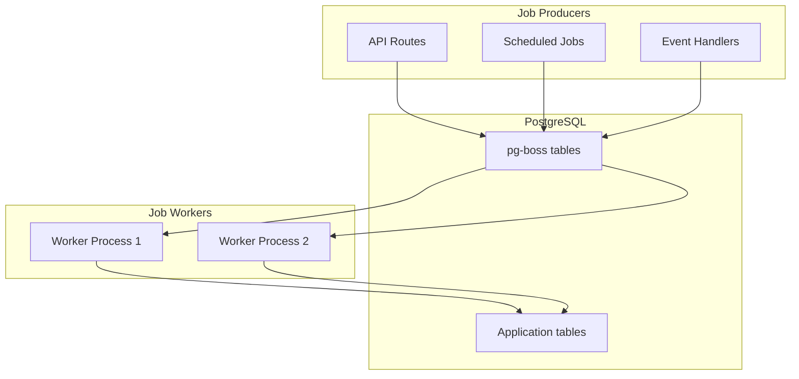

# Background Jobs with pg-boss

## Overview

The background job system uses pg-boss, a PostgreSQL-based job queue that eliminates the need for Redis. This provides a simpler architecture with fewer moving parts while maintaining reliability and performance.

## Why pg-boss?

- **One Less Dependency**: No Redis needed, PostgreSQL handles everything
- **Transactional**: Jobs are part of database transactions
- **Built-in Features**: Retries, scheduling, archiving included
- **Simple Setup**: Just a PostgreSQL schema
- **Good Performance**: Handles thousands of jobs/second

## Job System Architecture



## Setup

```typescript
import PgBoss from 'pg-boss';

class JobManager {
  private boss: PgBoss;

  async initialize() {
    this.boss = new PgBoss({
      connectionString: process.env.DATABASE_URL,
      schema: 'pgboss',

      // Simple configuration
      deleteAfterDays: 7,           // Delete completed jobs after 7 days
      maintenanceIntervalMinutes: 5, // Run maintenance every 5 minutes
      retryLimit: 3,                 // Retry failed jobs 3 times
      retryDelay: 60,               // Wait 60 seconds between retries
      expireInHours: 1,             // Expire stuck jobs after 1 hour
    });

    await this.boss.start();

    // Register job handlers
    await this.registerHandlers();

    // Schedule recurring jobs
    await this.scheduleJobs();
  }

  async registerHandlers() {
    // Pod provisioning
    await this.boss.work('provision-pod', async (job) => {
      const { podId, config } = job.data;
      await this.provisionPod(podId, config);
    });

    // Pod cleanup
    await this.boss.work('cleanup-pod', async (job) => {
      const { podId } = job.data;
      await this.cleanupPod(podId);
    });

    // Snapshot creation
    await this.boss.work('create-snapshot', async (job) => {
      const { podId } = job.data;
      await this.createSnapshot(podId);
    });

    // Health check
    await this.boss.work('health-check', { teamSize: 5 }, async (jobs) => {
      // Process health checks in batches
      await Promise.all(jobs.map(job => this.checkPodHealth(job.data.podId)));
    });
  }

  async scheduleJobs() {
    // Health checks every 5 minutes
    await this.boss.schedule('health-check-all', '*/5 * * * *', {});

    // Cleanup old resources daily
    await this.boss.schedule('cleanup-old', '0 2 * * *', {});

    // Calculate usage hourly
    await this.boss.schedule('calculate-usage', '0 * * * *', {});
  }
}
```

## Job Types

```typescript
// Simple job definitions - no complex types needed
type JobType =
  | 'provision-pod'
  | 'start-pod'
  | 'stop-pod'
  | 'cleanup-pod'
  | 'create-snapshot'
  | 'restore-snapshot'
  | 'health-check'
  | 'cleanup-old'
  | 'calculate-usage'
  | 'send-email';

interface JobData {
  'provision-pod': {
    podId: string;
    spec: PodSpec;
    userId: string;
  };
  'cleanup-pod': {
    podId: string;
  };
  'create-snapshot': {
    podId: string;
  };
  'health-check': {
    podId?: string; // Optional - check all if not specified
  };
}
```

## Job Handlers

### Pod Provisioning

```typescript
async function provisionPod(podId: string, spec: PodSpec) {
  try {
    // Update status
    await db.pods.update({
      where: { id: podId },
      data: { status: 'provisioning' }
    });

    // Pick a host
    const host = await pickAvailableHost(config.tier);

    // Create pod on host
    const response = await fetch(`http://${host.ip}:8080/create-pod`, {
      method: 'POST',
      headers: { 'X-API-Key': HOST_API_KEY },
      body: JSON.stringify({ podId, config })
    });

    if (!response.ok) {
      throw new Error(`Failed to create pod: ${response.statusText}`);
    }

    const { internalIp } = await response.json();

    // Update pod record
    await db.pods.update({
      where: { id: podId },
      data: {
        status: 'running',
        hostIp: host.ip,
        internalIp
      }
    });

    // Set up nginx routing
    await updateNginxRouting(podId, internalIp);

  } catch (error) {
    // Mark pod as failed
    await db.pods.update({
      where: { id: podId },
      data: { status: 'failed', error: error.message }
    });

    throw error; // Let pg-boss handle retry
  }
}
```

### Health Monitoring

```typescript
async function checkPodHealth(podId?: string) {
  const pods = podId
    ? [await db.pods.findUnique({ where: { id: podId } })]
    : await db.pods.findMany({ where: { status: 'running' } });

  for (const pod of pods) {
    try {
      // Simple HTTP health check
      const response = await fetch(`http://${pod.internalIp}:8080/health`, {
        timeout: 5000
      });

      if (!response.ok) {
        // Pod unhealthy - try to restart
        await boss.send('restart-pod', { podId: pod.id });
      }

      // Update last health check
      await db.pods.update({
        where: { id: pod.id },
        data: { lastHealthCheck: new Date() }
      });

    } catch (error) {
      console.error(`Health check failed for pod ${pod.id}:`, error);

      // Mark as unhealthy
      await db.pods.update({
        where: { id: pod.id },
        data: {
          status: 'unhealthy',
          lastHealthCheck: new Date()
        }
      });
    }
  }
}
```

### Cleanup Jobs

**Status**: ✅ **Implemented** (metrics cleanup)

```typescript
async function cleanupOldResources() {
  const fiveDaysAgo = new Date(Date.now() - 5 * 24 * 60 * 60 * 1000);
  const sevenDaysAgo = new Date(Date.now() - 7 * 24 * 60 * 60 * 1000);

  // Clean up old metrics (implemented)
  const serverMetricsDeleted = await db
    .delete(serverMetrics)
    .where(lt(serverMetrics.createdAt, fiveDaysAgo))
    .execute();

  const podMetricsDeleted = await db
    .delete(podMetrics)
    .where(lt(podMetrics.createdAt, fiveDaysAgo))
    .execute();

  const podLogsDeleted = await db
    .delete(podLogs)
    .where(lt(podLogs.createdAt, fiveDaysAgo))
    .execute();

  console.log('✅ Cleaned up old metrics:', {
    serverMetrics: serverMetricsDeleted.rowCount || 0,
    podMetrics: podMetricsDeleted.rowCount || 0,
    podLogs: podLogsDeleted.rowCount || 0,
  });

  // Clean up terminated pods older than 7 days (TODO)
  const oldPods = await db.pods.findMany({
    where: {
      status: 'terminated',
      updatedAt: { lt: sevenDaysAgo }
    }
  });

  for (const pod of oldPods) {
    // Remove SSH keys from GitHub
    if (pod.githubKeyId) {
      await removeGitHubKey(pod.githubKeyId);
    }

    // Delete pod record (cascades to related tables)
    await db.pods.delete({ where: { id: pod.id } });
  }

  // Clean up old snapshots (TODO)
  const oldSnapshots = await db.snapshots.findMany({
    where: {
      createdAt: { lt: new Date(Date.now() - 30 * 24 * 60 * 60 * 1000) }
    }
  });

  for (const snapshot of oldSnapshots) {
    // Delete from S3/MinIO
    await deleteSnapshot(snapshot.storageUrl);

    // Delete record
    await db.snapshots.delete({ where: { id: snapshot.id } });
  }
}
```

**Implementation**: `src/worker.ts` - Runs every hour

## Error Handling

```typescript
// Simple error handling - no dead letter queues
class JobError extends Error {
  constructor(
    message: string,
    public readonly shouldRetry: boolean = true
  ) {
    super(message);
  }
}

// In job handlers
async function someJobHandler(job: PgBoss.Job) {
  try {
    // Do work...
  } catch (error) {
    if (error instanceof ValidationError) {
      // Don't retry validation errors
      throw new JobError(error.message, false);
    }

    // Let pg-boss retry other errors
    throw error;
  }
}

// pg-boss configuration for retries
const boss = new PgBoss({
  retryLimit: 3,
  retryDelay: 60,        // seconds
  retryBackoff: true,    // exponential backoff

  // Failed jobs are kept for debugging
  deleteAfterDays: 7
});
```

## Job Monitoring

```typescript
class JobMonitor {
  async getStats() {
    const stats = await boss.getQueueSize();
    const failed = await boss.getQueueSize('failed');
    const completed = await boss.getQueueSize('completed');

    return {
      pending: stats,
      failed,
      completed,
      // Simple metrics - no complex monitoring
    };
  }

  async getFailedJobs() {
    // Query failed jobs for debugging
    const result = await db.query(`
      SELECT * FROM pgboss.job
      WHERE state = 'failed'
      ORDER BY createdon DESC
      LIMIT 100
    `);

    return result.rows;
  }
}

// Simple health endpoint
app.get('/api/jobs/health', async (req, res) => {
  const stats = await jobMonitor.getStats();

  res.json({
    healthy: stats.failed < 100,  // Alert if too many failures
    stats
  });
});
```

## Usage Examples

```typescript
// Send a job
await boss.send('provision-pod', {
  podId: 'pod-123',
  config: { tier: 'dev.small', /* ... */ }
});

// Send with options
await boss.send('cleanup-pod',
  { podId: 'pod-123' },
  {
    startAfter: 60,        // Delay 60 seconds
    priority: 10,          // Higher priority
    retryLimit: 1         // Only retry once
  }
);

// Schedule a job
await boss.schedule('health-check', '*/5 * * * *', {});

// Send multiple jobs
await boss.insert([
  { name: 'email', data: { to: 'user1@example.com' } },
  { name: 'email', data: { to: 'user2@example.com' } },
  { name: 'email', data: { to: 'user3@example.com' } }
]);
```

## Database Tables (Created by pg-boss)

```sql
-- pg-boss creates these tables automatically
CREATE SCHEMA IF NOT EXISTS pgboss;

-- Main job table
CREATE TABLE pgboss.job (
  id text PRIMARY KEY,
  name text NOT NULL,
  priority integer NOT NULL DEFAULT 0,
  data jsonb,
  state text NOT NULL,
  retryLimit integer NOT NULL DEFAULT 0,
  retryCount integer NOT NULL DEFAULT 0,
  retryDelay integer NOT NULL DEFAULT 0,
  retryBackoff boolean NOT NULL DEFAULT false,
  startAfter timestamp with time zone NOT NULL DEFAULT now(),
  startedOn timestamp with time zone,
  singletonKey text,
  singletonOn timestamp with time zone,
  expireIn interval NOT NULL DEFAULT '15 minutes'::interval,
  createdOn timestamp with time zone NOT NULL DEFAULT now(),
  completedOn timestamp with time zone
);

-- Archive table for completed/failed jobs
CREATE TABLE pgboss.archive (
  -- Same structure as job table
  -- Jobs moved here after completion
);

-- Schedule table for cron jobs
CREATE TABLE pgboss.schedule (
  name text PRIMARY KEY,
  cron text NOT NULL,
  timezone text,
  data jsonb,
  options jsonb
);
```

## Advantages Over Redis/BullMQ

1. **Simpler Stack**: One less service to manage
2. **Transactional**: Jobs are part of DB transactions
3. **No Network Hops**: Jobs and data in same database
4. **Built-in Archiving**: Automatic cleanup and archiving
5. **SQL Queryable**: Can query jobs with SQL
6. **Cheaper**: No Redis hosting costs

## Limitations (Acceptable for MVP)

1. **Lower Throughput**: ~1000 jobs/sec vs 10,000+ with Redis
2. **No Redis Features**: No pub/sub, no complex data structures
3. **Database Load**: Jobs add load to main database
4. **Simple Priority**: Basic priority queue, not as sophisticated

For our MVP scale (< 1000 users), pg-boss is more than sufficient and significantly simpler to operate.