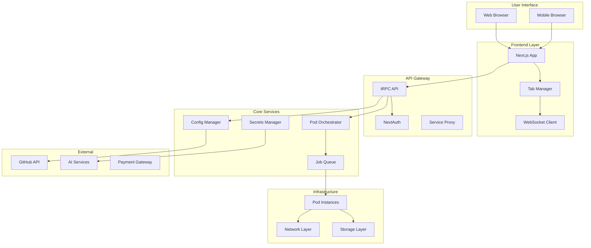
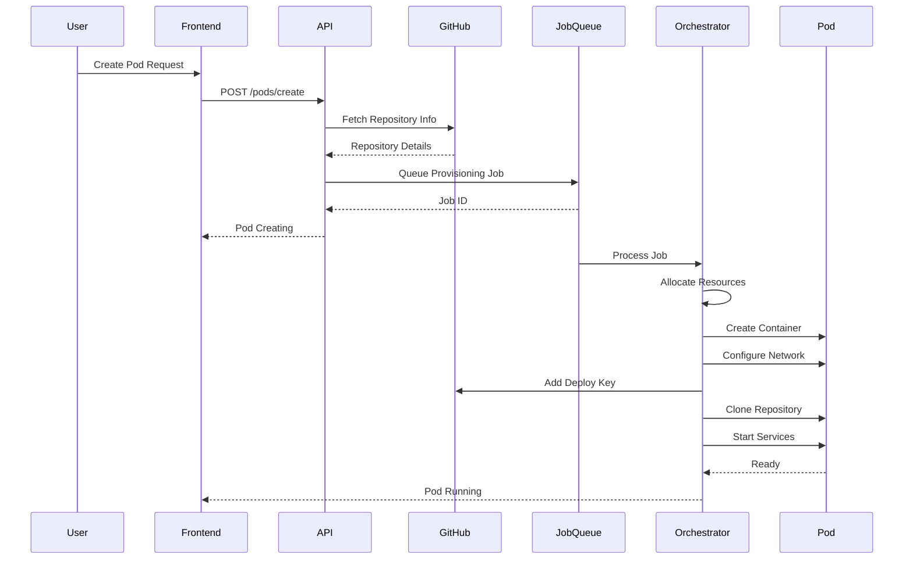
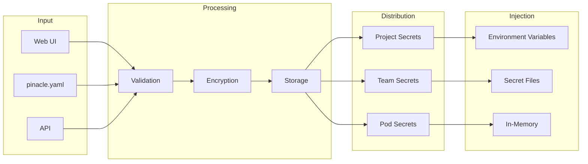
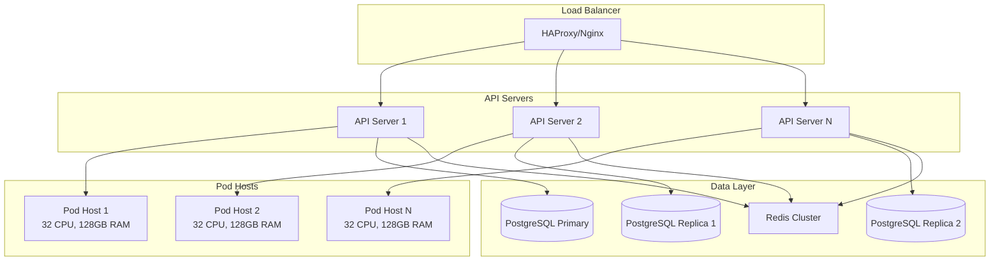
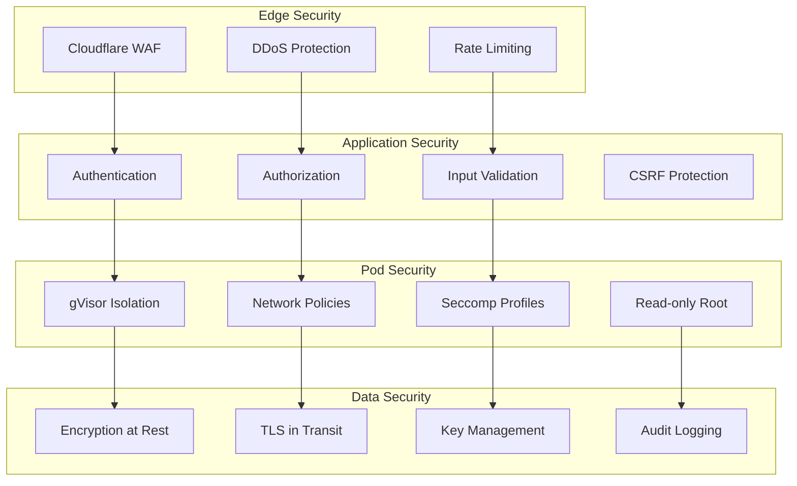

# Pinacle Architecture Summary

## Complete System Overview



## Key Architecture Decisions

### 1. Configuration as Code (YAML)
- **Decision**: Store pod configurations as `pinacle.yaml` files in user repositories
- **Rationale**: Version control, portability, GitOps compatibility
- **Benefits**: Easy sharing, reproducibility, infrastructure as code

### 2. Ephemeral SSH Keys
- **Decision**: Generate temporary SSH keys per pod with automatic rotation
- **Rationale**: Security, no permanent credential exposure
- **Benefits**: Reduced attack surface, automatic cleanup, audit trail

### 3. Subdomain-Based Routing
- **Decision**: Use pattern `{service}-{pod}-{user}.pinacle.dev`
- **Rationale**: Clear namespace separation, easy SSL management
- **Benefits**: Predictable URLs, wildcard SSL, simple proxy rules

### 4. gVisor Isolation
- **Decision**: Use gVisor for container runtime security
- **Rationale**: Kernel-level isolation without VM overhead
- **Benefits**: Enhanced security, resource efficiency, compatibility

### 5. Tab-Based UI
- **Decision**: Implement flexible tab system for multiple services
- **Rationale**: Developer productivity, familiar interface
- **Benefits**: Context switching, customization, persistence

## Data Flow Diagrams

### Pod Creation Flow



### Secret Management Flow



## Technology Stack

### Frontend
- **Framework**: Next.js 15 with TypeScript
- **UI Components**: shadcn/ui (Radix UI)
- **State Management**: Redux Toolkit
- **Real-time**: WebSocket (Socket.io)
- **Terminal**: XTerm.js
- **Editor**: Monaco Editor / CodeMirror

### Backend
- **Runtime**: Node.js 20 LTS
- **API**: tRPC v11
- **Database**: PostgreSQL with Drizzle ORM
- **Cache**: Redis
- **Queue**: BullMQ
- **Authentication**: NextAuth.js

### Infrastructure
- **Container Runtime**: gVisor (runsc)
- **Orchestration**: Custom Pod Orchestrator
- **Networking**: Linux namespaces, iptables
- **Storage**: Local volumes, S3-compatible object storage
- **Proxy**: Nginx with dynamic configuration
- **SSL**: Let's Encrypt with automatic renewal

### External Services
- **Version Control**: GitHub API
- **AI Services**: Claude API, OpenAI API
- **Payment**: Stripe
- **Monitoring**: Prometheus + Grafana
- **Logging**: ELK Stack
- **Error Tracking**: Sentry

## Scalability Architecture



## Security Architecture

### Defense in Depth



## Deployment Architecture

### Production Deployment

```yaml
# Kubernetes Deployment Example
apiVersion: apps/v1
kind: Deployment
metadata:
  name: pinacle-api
spec:
  replicas: 3
  selector:
    matchLabels:
      app: pinacle-api
  template:
    metadata:
      labels:
        app: pinacle-api
    spec:
      containers:
      - name: api
        image: pinacle/api:latest
        ports:
        - containerPort: 3000
        env:
        - name: NODE_ENV
          value: production
        resources:
          requests:
            cpu: 500m
            memory: 1Gi
          limits:
            cpu: 2000m
            memory: 4Gi
---
apiVersion: v1
kind: Service
metadata:
  name: pinacle-api-service
spec:
  selector:
    app: pinacle-api
  ports:
  - port: 80
    targetPort: 3000
  type: LoadBalancer
```

## Resource Allocation Strategy

### Pod Tiers

| Tier | CPU | Memory | Storage | Burst | Max Pods/User | Price/Month |
|------|-----|--------|---------|-------|---------------|-------------|
| dev.small | 0.5 vCPU | 1 GB | 10 GB | Yes | 3 | $8 |
| dev.medium | 1 vCPU | 2 GB | 20 GB | No | 2 | $16 |
| dev.large | 2 vCPU | 4 GB | 40 GB | No | 2 | $32 |
| dev.xlarge | 4 vCPU | 8 GB | 80 GB | No | 1 | $64 |
| dev.2xlarge | 8 vCPU | 16 GB | 160 GB | No | 1 | $128 |

### Host Capacity Planning

```
Per Host (32 CPU, 128GB RAM):
- Maximum Pods: 64 (dev.small)
- Typical Mix:
  - 20 dev.small (10 CPU, 20 GB)
  - 10 dev.medium (10 CPU, 20 GB)
  - 5 dev.large (10 CPU, 20 GB)
  - 2 dev.xlarge (8 CPU, 16 GB)

Total: 38 CPU (oversubscribed), 76 GB RAM
Buffer: ~20% for system overhead
```

## Monitoring Dashboard

### Key Metrics

```typescript
interface SystemMetrics {
  // Infrastructure
  hosts: {
    total: number;
    active: number;
    cpuUtilization: number;
    memoryUtilization: number;
  };

  // Pods
  pods: {
    total: number;
    running: number;
    stopped: number;
    failed: number;
    averageUptime: number;
  };

  // Performance
  performance: {
    apiLatency: {
      p50: number;
      p95: number;
      p99: number;
    };
    jobQueueLength: number;
    jobProcessingRate: number;
  };

  // Business
  business: {
    activeUsers: number;
    newSignups: number;
    revenue: {
      mrr: number;
      arr: number;
    };
    churn: number;
  };
}
```

## Disaster Recovery Plan

### Backup Strategy

1. **Database Backups**
   - Continuous replication to standby
   - Daily snapshots retained for 30 days
   - Weekly backups retained for 90 days
   - Monthly backups retained for 1 year

2. **Pod State Backups**
   - Workspace snapshots every 6 hours
   - Configuration backups on every change
   - Secret backups with encryption

3. **Recovery Procedures**
   - RPO (Recovery Point Objective): 1 hour
   - RTO (Recovery Time Objective): 4 hours
   - Automated failover for critical services
   - Manual intervention for data recovery

## Implementation Roadmap

### Phase 1: MVP (Months 1-2)
- ✅ Basic pod provisioning
- ✅ GitHub integration
- ✅ Simple UI with terminal
- ✅ Next.js template support
- ✅ Basic authentication

### Phase 2: Core Features (Months 3-4)
- [ ] Full template system
- [ ] Secret management
- [ ] Health monitoring
- [ ] Team collaboration
- [ ] Billing integration

### Phase 3: Advanced Features (Months 5-6)
- [ ] Auto-scaling
- [ ] Custom domains
- [ ] IDE plugins
- [ ] Mobile app
- [ ] Enterprise features

### Phase 4: Scale (Months 7-12)
- [ ] Multi-region deployment
- [ ] Advanced security features
- [ ] Marketplace for templates
- [ ] API for third-party integrations
- [ ] White-label solution

## Cost Analysis

### Infrastructure Costs (Monthly)

```
Hosting (AWS/GCP):
- API Servers (3x c5.xlarge): $450
- Pod Hosts (10x c5.metal): $3,400
- Database (RDS Multi-AZ): $500
- Redis Cluster: $200
- Storage (S3): $300
- Bandwidth: $500
- Total: ~$5,350

Services:
- Cloudflare Pro: $200
- Monitoring (Datadog): $500
- Error Tracking (Sentry): $100
- SSL Certificates: $0 (Let's Encrypt)
- Total: ~$800

Grand Total: ~$6,150/month
```

### Revenue Projections

```
Target Users by Tier (Year 1):
- dev.small ($8): 500 users = $4,000
- dev.medium ($16): 300 users = $4,800
- dev.large ($32): 150 users = $4,800
- dev.xlarge ($64): 50 users = $3,200

Total MRR: $16,800
Total ARR: $201,600

Break-even: ~385 paying users
```

## Success Metrics

### Technical KPIs
- Pod provisioning time < 30 seconds
- API response time p95 < 200ms
- Uptime > 99.9%
- Pod failure rate < 1%
- SSH key rotation success rate > 99.99%

### Business KPIs
- User acquisition cost < $50
- Customer lifetime value > $500
- Monthly churn rate < 5%
- Net Promoter Score > 50
- Support ticket resolution < 24 hours

## Conclusion

The Pinacle architecture is designed for reliability, security, and scalability. By leveraging modern technologies like gVisor for isolation, tRPC for type-safe APIs, and a flexible configuration system, we can provide developers with a powerful, secure, and easy-to-use platform for AI-assisted development.

Key strengths:
1. **Security First**: Multiple layers of isolation and encryption
2. **Developer Experience**: Intuitive UI, fast provisioning, flexible configuration
3. **Scalability**: Horizontal scaling, efficient resource utilization
4. **Reliability**: Comprehensive monitoring, automatic recovery, backup strategies
5. **Extensibility**: Template system, plugin architecture, API access

This architecture provides a solid foundation for building a production-ready platform that can scale from hundreds to tens of thousands of users while maintaining high performance and reliability.
