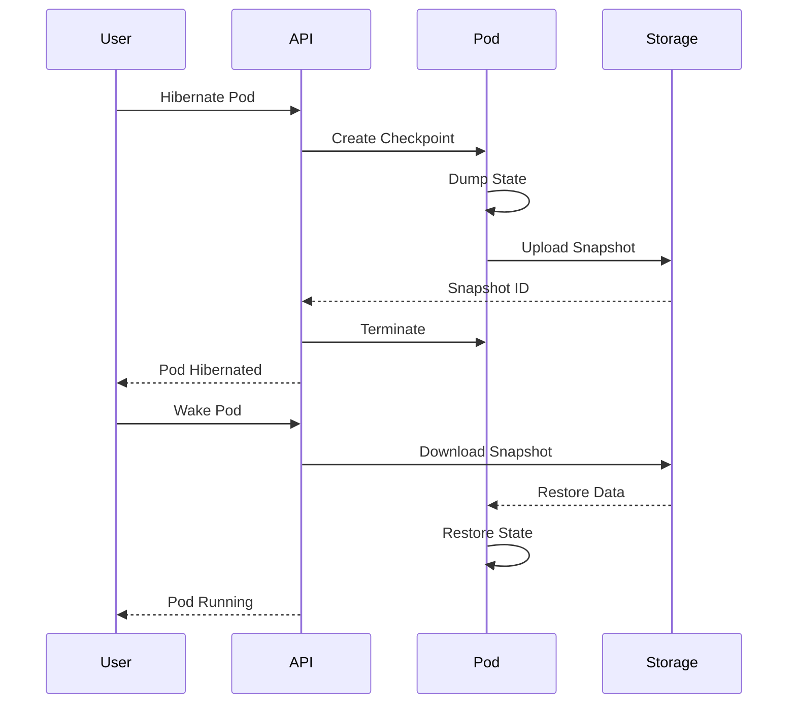

# Snapshot and Hibernation System

## Overview

The snapshot system allows pods to be suspended to disk and restored later, saving resources and costs. Snapshots are stored in S3-compatible storage (MinIO for development, S3/Cloudflare R2 for production).

## Architecture



## Snapshot Process

### 1. Creating Snapshots

```typescript
interface Snapshot {
  id: string;
  podId: string;
  size: number;           // bytes
  storageUrl: string;     // S3 URL
  createdAt: Date;
  metadata: {
    tier: string;
    repository: string;
    lastCommit?: string;
    services: string[];
  };
}

class SnapshotService {
  private s3: S3Client;

  constructor() {
    this.s3 = new S3Client({
      endpoint: process.env.S3_ENDPOINT,
      credentials: {
        accessKeyId: process.env.S3_ACCESS_KEY,
        secretAccessKey: process.env.S3_SECRET_KEY
      }
    });
  }

  async createSnapshot(podId: string): Promise<Snapshot> {
    const pod = await db.pods.findUnique({ where: { id: podId } });
    if (!pod) throw new Error('Pod not found');

    // Stop services gracefully
    await this.stopServices(pod);

    // Create filesystem snapshot
    const tarPath = await this.createTarball(pod);

    // Upload to S3
    const storageUrl = await this.uploadSnapshot(podId, tarPath);

    // Save metadata
    const snapshot = await db.snapshots.create({
      data: {
        id: generateId(),
        podId,
        size: await getFileSize(tarPath),
        storageUrl,
        metadata: {
          tier: pod.tier,
          repository: pod.githubRepo,
          services: pod.config.services
        },
        createdAt: new Date()
      }
    });

    // Clean up local files
    await fs.unlink(tarPath);

    return snapshot;
  }

  private async createTarball(pod: Pod): Promise<string> {
    const tarPath = `/tmp/snapshot-${pod.id}.tar.gz`;

    // Create tarball of pod filesystem
    await exec(`
      docker exec pod-${pod.id} tar -czf /tmp/snapshot.tar.gz \
        /workspace \
        /home \
        /etc/environment \
        /var/log
    `);

    // Copy from container
    await exec(`
      docker cp pod-${pod.id}:/tmp/snapshot.tar.gz ${tarPath}
    `);

    return tarPath;
  }

  private async uploadSnapshot(podId: string, tarPath: string): Promise<string> {
    const key = `snapshots/${podId}/${Date.now()}.tar.gz`;

    const fileStream = fs.createReadStream(tarPath);

    await this.s3.send(new PutObjectCommand({
      Bucket: process.env.S3_BUCKET,
      Key: key,
      Body: fileStream,
      ContentType: 'application/gzip'
    }));

    return `s3://${process.env.S3_BUCKET}/${key}`;
  }
}
```

### 2. Restoring Snapshots

```typescript
class RestoreService {
  async restoreFromSnapshot(snapshotId: string): Promise<Pod> {
    const snapshot = await db.snapshots.findUnique({
      where: { id: snapshotId },
      include: { pod: true }
    });

    if (!snapshot) throw new Error('Snapshot not found');

    // Download snapshot
    const tarPath = await this.downloadSnapshot(snapshot);

    // Create new pod container
    const containerId = await this.createContainer(snapshot.pod);

    // Restore filesystem
    await this.restoreFilesystem(containerId, tarPath);

    // Start services
    await this.startServices(snapshot.pod);

    // Update pod status
    await db.pods.update({
      where: { id: snapshot.podId },
      data: {
        status: 'running',
        wokeAt: new Date()
      }
    });

    // Clean up
    await fs.unlink(tarPath);

    return snapshot.pod;
  }

  private async downloadSnapshot(snapshot: Snapshot): Promise<string> {
    const tarPath = `/tmp/restore-${snapshot.podId}.tar.gz`;

    const response = await this.s3.send(new GetObjectCommand({
      Bucket: process.env.S3_BUCKET,
      Key: snapshot.storageUrl.replace('s3://' + process.env.S3_BUCKET + '/', '')
    }));

    const stream = fs.createWriteStream(tarPath);
    response.Body.pipe(stream);

    await new Promise((resolve, reject) => {
      stream.on('finish', resolve);
      stream.on('error', reject);
    });

    return tarPath;
  }

  private async restoreFilesystem(containerId: string, tarPath: string): Promise<void> {
    // Copy tarball to container
    await exec(`docker cp ${tarPath} ${containerId}:/tmp/restore.tar.gz`);

    // Extract in container
    await exec(`
      docker exec ${containerId} tar -xzf /tmp/restore.tar.gz -C /
    `);

    // Clean up
    await exec(`docker exec ${containerId} rm /tmp/restore.tar.gz`);
  }
}
```

## Database Schema

```sql
CREATE TABLE snapshots (
  id UUID PRIMARY KEY,
  pod_id UUID REFERENCES pods(id) ON DELETE CASCADE,
  size BIGINT,                    -- Size in bytes
  storage_url TEXT NOT NULL,      -- S3 URL
  metadata JSONB,                  -- Additional metadata
  created_at TIMESTAMP DEFAULT NOW(),
  expires_at TIMESTAMP             -- Auto-cleanup
);

-- Add hibernation tracking to pods
ALTER TABLE pods
  ADD COLUMN hibernated_at TIMESTAMP,
  ADD COLUMN woke_at TIMESTAMP,
  ADD COLUMN last_snapshot_id UUID REFERENCES snapshots(id);

-- Index for cleanup
CREATE INDEX idx_snapshots_expires ON snapshots(expires_at)
  WHERE expires_at IS NOT NULL;
```

## API Endpoints

```typescript
// Hibernate a pod
app.post('/api/pods/:id/hibernate', async (req, res) => {
  const { id } = req.params;

  // Create snapshot
  const snapshot = await snapshotService.createSnapshot(id);

  // Stop and remove pod
  await podService.stopPod(id);

  // Update pod status
  await db.pods.update({
    where: { id },
    data: {
      status: 'hibernated',
      hibernatedAt: new Date(),
      lastSnapshotId: snapshot.id
    }
  });

  res.json({ success: true, snapshotId: snapshot.id });
});

// Wake a pod
app.post('/api/pods/:id/wake', async (req, res) => {
  const { id } = req.params;

  const pod = await db.pods.findUnique({
    where: { id },
    include: { snapshot: true }
  });

  if (!pod.lastSnapshotId) {
    return res.status(400).json({ error: 'No snapshot available' });
  }

  // Queue restoration job
  await boss.send('restore-snapshot', {
    podId: id,
    snapshotId: pod.lastSnapshotId
  });

  res.json({ success: true, message: 'Pod waking up...' });
});
```

## Storage Management

### S3 Configuration

```typescript
// Production: Use S3 or Cloudflare R2
const s3Config = {
  production: {
    endpoint: 'https://s3.amazonaws.com',
    region: 'us-east-1',
    bucket: 'pinacle-snapshots'
  },

  // Development: Use MinIO
  development: {
    endpoint: 'http://localhost:9000',
    region: 'us-east-1',
    bucket: 'pinacle-snapshots',
    forcePathStyle: true
  }
};
```

### Storage Costs

```typescript
// Snapshot size estimation
const estimateSnapshotSize = (pod: Pod): number => {
  const baseSize = 100 * 1024 * 1024;  // 100MB base
  const workspaceSize = pod.config.estimatedSize || 500 * 1024 * 1024;

  // Compression ratio ~30%
  return Math.floor((baseSize + workspaceSize) * 0.3);
};

// Monthly storage cost
const calculateStorageCost = (totalSize: number): number => {
  const gbSize = totalSize / (1024 * 1024 * 1024);
  const pricePerGb = 0.023;  // S3 Standard
  return gbSize * pricePerGb;
};
```

## Cleanup Policy

```typescript
// Scheduled job to clean old snapshots
await boss.schedule('cleanup-snapshots', '0 2 * * *', {});

async function cleanupSnapshots() {
  // Delete snapshots older than 30 days
  const oldSnapshots = await db.snapshots.findMany({
    where: {
      createdAt: {
        lt: new Date(Date.now() - 30 * 24 * 60 * 60 * 1000)
      }
    }
  });

  for (const snapshot of oldSnapshots) {
    // Delete from S3
    await s3.send(new DeleteObjectCommand({
      Bucket: process.env.S3_BUCKET,
      Key: getS3Key(snapshot.storageUrl)
    }));

    // Delete record
    await db.snapshots.delete({ where: { id: snapshot.id } });
  }

  // Keep only latest 3 snapshots per pod
  const pods = await db.pods.findMany();

  for (const pod of pods) {
    const snapshots = await db.snapshots.findMany({
      where: { podId: pod.id },
      orderBy: { createdAt: 'desc' },
      skip: 3
    });

    // Delete older snapshots
    for (const snapshot of snapshots) {
      await deleteSnapshot(snapshot);
    }
  }
}
```

## Limitations

### What Gets Preserved
- ✅ Filesystem state
- ✅ Installed packages
- ✅ User files and code
- ✅ Environment variables
- ✅ Git repository state

### What Doesn't Get Preserved
- ❌ Running processes (need restart)
- ❌ Network connections
- ❌ Memory state
- ❌ Open file handles
- ❌ Database connections

### User Impact
- Services need to reconnect after wake
- Long-running processes need manual restart
- Temporary files in /tmp are lost
- System time jumps forward

## Cost Optimization

```typescript
// Auto-hibernate idle pods
await boss.schedule('auto-hibernate', '*/30 * * * *', {});

async function autoHibernate() {
  // Find idle pods (no activity for 2 hours)
  const idlePods = await db.pods.findMany({
    where: {
      status: 'running',
      lastActivity: {
        lt: new Date(Date.now() - 2 * 60 * 60 * 1000)
      }
    }
  });

  for (const pod of idlePods) {
    // Check if user has auto-hibernate enabled
    if (pod.config.autoHibernate) {
      await boss.send('hibernate-pod', { podId: pod.id });
    }
  }
}

// Pricing incentive
const pricing = {
  running: 0.008,      // $0.008/hour
  hibernated: 0.001,   // $0.001/hour (storage only)
  savings: 87.5        // 87.5% cost reduction
};
```

## Testing Snapshots Locally

```bash
# Create snapshot
curl -X POST http://localhost:3000/api/pods/test-123/hibernate

# Check snapshot in MinIO
docker exec -it minio mc ls local/pinacle-snapshots/snapshots/test-123/

# Wake pod
curl -X POST http://localhost:3000/api/pods/test-123/wake

# Verify restoration
docker exec -it pod-test-123 ls /workspace
```
