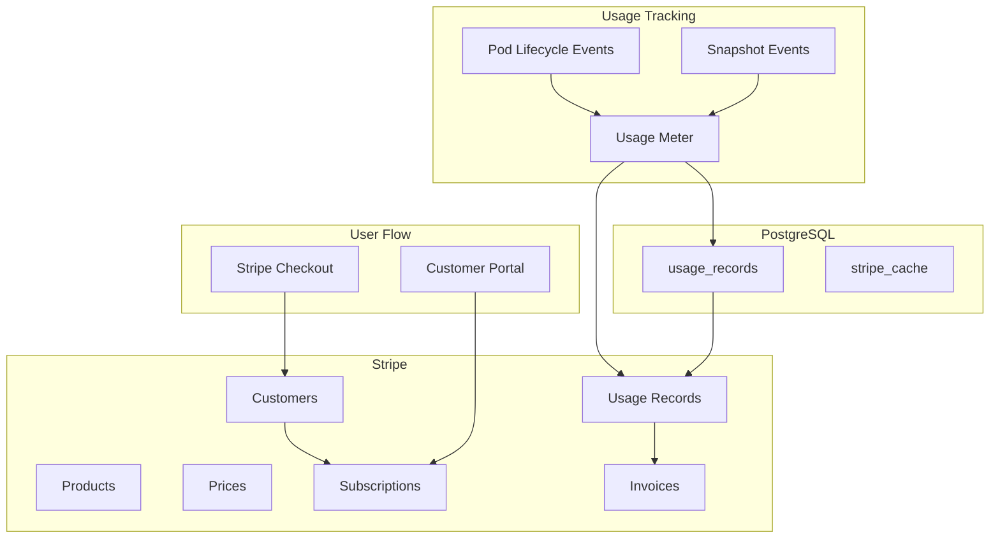

# Billing System with Stripe

## Overview

Usage-based billing system using Stripe as the source of truth for all financial data. We track pod runtime hours and snapshot storage, report usage to Stripe, and let Stripe handle all the complex billing logic, invoicing, and payment processing.

## Architecture



## Stripe Configuration

### Products and Prices

```typescript
// Stripe products (created once via Stripe Dashboard or API)
const stripeProducts = {
  // Runtime hours per tier
  'pod_runtime_small': {
    name: 'Pod Runtime - Small',
    unit: 'hour',
    price: 0.00833,  // $6/month = $0.00833/hour (720 hours)
  },
  'pod_runtime_medium': {
    name: 'Pod Runtime - Medium',
    unit: 'hour',
    price: 0.01667,  // $12/month = $0.01667/hour
  },
  'pod_runtime_large': {
    name: 'Pod Runtime - Large',
    unit: 'hour',
    price: 0.03333,  // $24/month = $0.03333/hour
  },
  'pod_runtime_xlarge': {
    name: 'Pod Runtime - XLarge',
    unit: 'hour',
    price: 0.06667,  // $48/month = $0.06667/hour
  },

  // Snapshot storage
  'snapshot_storage': {
    name: 'Snapshot Storage',
    unit: 'gb_hour',
    price: 0.00001,  // $0.01 per GB per month = $0.00001/GB/hour
  }
};

// Create in Stripe
async function setupStripeProducts() {
  for (const [key, product of Object.entries(stripeProducts)) {
    // Create product
    const stripeProduct = await stripe.products.create({
      id: key,
      name: product.name,
      unit_label: product.unit
    });

    // Create usage-based price
    await stripe.prices.create({
      product: stripeProduct.id,
      currency: 'usd',
      unit_amount_decimal: (product.price * 100).toString(), // Stripe uses cents
      recurring: {
        interval: 'month',
        usage_type: 'metered',
        aggregate_usage: 'sum'
      }
    });
  }
}
```

## Database Schema

```sql
-- Local usage tracking (backup/reconciliation)
CREATE TABLE usage_records (
  id UUID PRIMARY KEY,
  user_id UUID REFERENCES users(id),
  pod_id UUID REFERENCES pods(id),
  type VARCHAR(50), -- 'runtime' or 'storage'
  tier VARCHAR(50), -- 'dev.small', 'dev.medium', etc
  quantity DECIMAL(10,4), -- Hours or GB-hours
  period_start TIMESTAMP NOT NULL,
  period_end TIMESTAMP NOT NULL,
  reported_to_stripe BOOLEAN DEFAULT FALSE,
  stripe_usage_record_id VARCHAR(255),
  created_at TIMESTAMP DEFAULT NOW()
);

-- Stripe customer mapping
CREATE TABLE stripe_customers (
  id UUID PRIMARY KEY,
  user_id UUID REFERENCES users(id) UNIQUE,
  stripe_customer_id VARCHAR(255) UNIQUE,
  stripe_subscription_id VARCHAR(255),
  payment_method_id VARCHAR(255),
  status VARCHAR(50), -- 'active', 'past_due', 'canceled'
  created_at TIMESTAMP DEFAULT NOW(),
  updated_at TIMESTAMP DEFAULT NOW()
);

-- Cache Stripe data for quick access
CREATE TABLE stripe_cache (
  id UUID PRIMARY KEY,
  user_id UUID REFERENCES users(id),
  type VARCHAR(50), -- 'invoice', 'payment', 'subscription'
  stripe_id VARCHAR(255),
  data JSONB,
  created_at TIMESTAMP DEFAULT NOW()
);

-- Indexes for performance
CREATE INDEX idx_usage_records_reporting ON usage_records(reported_to_stripe, created_at);
CREATE INDEX idx_usage_records_user_period ON usage_records(user_id, period_start, period_end);
```

## Usage Tracking

### Runtime Hours Tracking

```typescript
class UsageTracker {
  // Track pod runtime every hour
  async trackPodRuntime() {
    const runningPods = await db.pods.findMany({
      where: { status: 'running' },
      include: { owner: true }
    });

    const now = new Date();
    const hourAgo = new Date(now.getTime() - 60 * 60 * 1000);

    for (const pod of runningPods) {
      // Record usage locally
      const usage = await db.usageRecords.create({
        data: {
          id: generateId(),
          userId: pod.ownerId,
          podId: pod.id,
          type: 'runtime',
          tier: pod.tier,
          quantity: 1, // 1 hour
          periodStart: hourAgo,
          periodEnd: now,
          reportedToStripe: false
        }
      });

      // Report to Stripe immediately
      await this.reportToStripe(usage, pod.owner);
    }
  }

  // Track snapshot storage daily
  async trackSnapshotStorage() {
    const snapshots = await db.snapshots.findMany({
      include: { pod: { include: { owner: true } } }
    });

    const now = new Date();
    const dayAgo = new Date(now.getTime() - 24 * 60 * 60 * 1000);

    // Group by user
    const userStorage = new Map<string, number>();

    for (const snapshot of snapshots) {
      const currentSize = userStorage.get(snapshot.pod.ownerId) || 0;
      const sizeInGb = snapshot.size / (1024 * 1024 * 1024);
      userStorage.set(snapshot.pod.ownerId, currentSize + sizeInGb);
    }

    // Record usage
    for (const [userId, totalGb] of userStorage.entries()) {
      const usage = await db.usageRecords.create({
        data: {
          id: generateId(),
          userId,
          type: 'storage',
          quantity: totalGb * 24, // GB-hours for the day
          periodStart: dayAgo,
          periodEnd: now,
          reportedToStripe: false
        }
      });

      const user = await db.users.findUnique({ where: { id: userId } });
      await this.reportToStripe(usage, user);
    }
  }

  private async reportToStripe(usage: UsageRecord, user: User) {
    const stripeCustomer = await db.stripeCustomers.findUnique({
      where: { userId: user.id }
    });

    if (!stripeCustomer?.stripeSubscriptionId) {
      console.log(`No subscription for user ${user.id}`);
      return;
    }

    try {
      // Get the right price ID based on type and tier
      const priceId = this.getStripePriceId(usage.type, usage.tier);

      // Report usage to Stripe
      const stripeRecord = await stripe.subscriptionItems.createUsageRecord(
        stripeCustomer.stripeSubscriptionId,
        {
          quantity: Math.ceil(usage.quantity), // Round up
          timestamp: Math.floor(usage.periodEnd.getTime() / 1000),
          action: 'increment'
        }
      );

      // Mark as reported
      await db.usageRecords.update({
        where: { id: usage.id },
        data: {
          reportedToStripe: true,
          stripeUsageRecordId: stripeRecord.id
        }
      });
    } catch (error) {
      console.error(`Failed to report usage to Stripe:`, error);
      // Will retry on next run
    }
  }
}

// Schedule usage tracking
await boss.schedule('track-runtime', '0 * * * *', {}); // Every hour
await boss.schedule('track-storage', '0 0 * * *', {}); // Daily at midnight
```

## Customer Onboarding

### Stripe Checkout Flow

```typescript
// After user selects their pod configuration
app.post('/api/billing/create-checkout', async (req, res) => {
  const { tier } = req.body;
  const userId = req.session.user.id;

  const user = await db.users.findUnique({ where: { id: userId } });

  // Create or get Stripe customer
  let stripeCustomer = await db.stripeCustomers.findUnique({
    where: { userId }
  });

  if (!stripeCustomer) {
    // Create Stripe customer
    const customer = await stripe.customers.create({
      email: user.email,
      metadata: {
        userId: user.id,
        githubUsername: user.githubUsername
      }
    });

    stripeCustomer = await db.stripeCustomers.create({
      data: {
        id: generateId(),
        userId,
        stripeCustomerId: customer.id
      }
    });
  }

  // Create checkout session
  const session = await stripe.checkout.sessions.create({
    customer: stripeCustomer.stripeCustomerId,
    payment_method_types: ['card'],
    mode: 'subscription',
    line_items: [
      {
        price: this.getStripePriceId('runtime', tier),
        quantity: 1
      }
    ],
    subscription_data: {
      metadata: {
        userId,
        tier
      }
    },
    success_url: `${process.env.APP_URL}/dashboard/pods/new?session_id={CHECKOUT_SESSION_ID}`,
    cancel_url: `${process.env.APP_URL}/dashboard/pods/new?canceled=true`
  });

  res.json({ checkoutUrl: session.url });
});

// Handle successful checkout
app.post('/api/billing/checkout-success', async (req, res) => {
  const { sessionId } = req.body;

  const session = await stripe.checkout.sessions.retrieve(sessionId);

  if (session.payment_status === 'paid') {
    // Update customer record
    await db.stripeCustomers.update({
      where: { stripeCustomerId: session.customer },
      data: {
        stripeSubscriptionId: session.subscription,
        status: 'active',
        paymentMethodId: session.payment_method
      }
    });

    // Now user can create pods
    res.json({ success: true });
  }
});
```

### UI Integration

```tsx
// Pod creation flow with billing
const CreatePodFlow: React.FC = () => {
  const [step, setStep] = useState<'config' | 'billing' | 'creating'>('config');
  const [hasSubscription, setHasSubscription] = useState(false);

  useEffect(() => {
    checkSubscription();
  }, []);

  const checkSubscription = async () => {
    const res = await fetch('/api/billing/subscription-status');
    const { active } = await res.json();
    setHasSubscription(active);
  };

  const handleCreatePod = async (config: PodConfig) => {
    // Check if user has active subscription
    if (!hasSubscription) {
      // Redirect to Stripe Checkout
      const res = await fetch('/api/billing/create-checkout', {
        method: 'POST',
        body: JSON.stringify({ tier: config.tier })
      });

      const { checkoutUrl } = await res.json();
      window.location.href = checkoutUrl;
      return;
    }

    // User has subscription, create pod
    await createPod(config);
  };

  return (
    <div>
      {step === 'config' && (
        <PodConfigForm onSubmit={handleCreatePod} />
      )}

      {/* After Stripe redirect */}
      {step === 'creating' && (
        <div>
          <Spinner />
          <p>Creating your pod...</p>
        </div>
      )}
    </div>
  );
};
```

## Stripe Webhooks

```typescript
// Handle Stripe events
app.post('/api/stripe/webhook', async (req, res) => {
  const sig = req.headers['stripe-signature'];
  let event;

  try {
    event = stripe.webhooks.constructEvent(
      req.body,
      sig,
      process.env.STRIPE_WEBHOOK_SECRET
    );
  } catch (err) {
    return res.status(400).send(`Webhook Error: ${err.message}`);
  }

  switch (event.type) {
    case 'customer.subscription.created':
    case 'customer.subscription.updated':
      await handleSubscriptionUpdate(event.data.object);
      break;

    case 'customer.subscription.deleted':
      await handleSubscriptionCanceled(event.data.object);
      break;

    case 'invoice.payment_succeeded':
      await handlePaymentSuccess(event.data.object);
      break;

    case 'invoice.payment_failed':
      await handlePaymentFailed(event.data.object);
      break;

    case 'invoice.created':
      // Invoice created with usage - this is where Stripe calculates the bill
      await cacheInvoice(event.data.object);
      break;
  }

  res.json({ received: true });
});

async function handleSubscriptionCanceled(subscription: Stripe.Subscription) {
  // Update local record
  await db.stripeCustomers.update({
    where: { stripeSubscriptionId: subscription.id },
    data: { status: 'canceled' }
  });

  // Stop all user's pods
  const customer = await db.stripeCustomers.findUnique({
    where: { stripeSubscriptionId: subscription.id }
  });

  if (customer) {
    const pods = await db.pods.findMany({
      where: {
        ownerId: customer.userId,
        status: 'running'
      }
    });

    for (const pod of pods) {
      await boss.send('stop-pod', { podId: pod.id });
    }
  }
}
```

## Customer Portal

```typescript
// Redirect to Stripe Customer Portal for billing management
app.post('/api/billing/create-portal-session', async (req, res) => {
  const userId = req.session.user.id;

  const stripeCustomer = await db.stripeCustomers.findUnique({
    where: { userId }
  });

  if (!stripeCustomer) {
    return res.status(404).json({ error: 'No billing account found' });
  }

  // Create portal session
  const session = await stripe.billingPortal.sessions.create({
    customer: stripeCustomer.stripeCustomerId,
    return_url: `${process.env.APP_URL}/dashboard/billing`
  });

  res.json({ url: session.url });
});

// Simple billing page
const BillingPage: React.FC = () => {
  const handleManageBilling = async () => {
    const res = await fetch('/api/billing/create-portal-session', {
      method: 'POST'
    });
    const { url } = await res.json();
    window.location.href = url;
  };

  return (
    <div>
      <h2>Billing</h2>
      <p>Manage your subscription, payment methods, and invoices.</p>
      <Button onClick={handleManageBilling}>
        Manage Billing in Stripe
      </Button>
    </div>
  );
};
```

## Usage Dashboard

```typescript
// Show current usage to user
app.get('/api/billing/current-usage', async (req, res) => {
  const userId = req.session.user.id;

  // Get current billing period
  const now = new Date();
  const startOfMonth = new Date(now.getFullYear(), now.getMonth(), 1);

  // Get usage from local records (faster than Stripe API)
  const usage = await db.usageRecords.findMany({
    where: {
      userId,
      periodStart: { gte: startOfMonth }
    }
  });

  // Calculate totals
  const runtimeHours = usage
    .filter(u => u.type === 'runtime')
    .reduce((sum, u) => sum + u.quantity, 0);

  const storageGbHours = usage
    .filter(u => u.type === 'storage')
    .reduce((sum, u) => sum + u.quantity, 0);

  // Estimate costs
  const runtimeCost = runtimeHours * 0.00833; // Simplified, should vary by tier
  const storageCost = storageGbHours * 0.00001;

  res.json({
    period: {
      start: startOfMonth,
      end: now
    },
    usage: {
      runtimeHours,
      storageGbHours
    },
    estimatedCost: {
      runtime: runtimeCost,
      storage: storageCost,
      total: runtimeCost + storageCost
    }
  });
});
```

## Reconciliation

```typescript
// Daily job to reconcile with Stripe
await boss.schedule('reconcile-billing', '0 2 * * *', {});

async function reconcileBilling() {
  // Find unreported usage
  const unreported = await db.usageRecords.findMany({
    where: {
      reportedToStripe: false,
      createdAt: {
        lt: new Date(Date.now() - 60 * 60 * 1000) // Older than 1 hour
      }
    }
  });

  console.log(`Found ${unreported.length} unreported usage records`);

  for (const usage of unreported) {
    const user = await db.users.findUnique({ where: { id: usage.userId } });
    await usageTracker.reportToStripe(usage, user);
  }

  // Sync subscription statuses
  const customers = await db.stripeCustomers.findMany();

  for (const customer of customers) {
    if (!customer.stripeSubscriptionId) continue;

    try {
      const subscription = await stripe.subscriptions.retrieve(
        customer.stripeSubscriptionId
      );

      if (subscription.status !== customer.status) {
        await db.stripeCustomers.update({
          where: { id: customer.id },
          data: { status: subscription.status }
        });
      }
    } catch (error) {
      console.error(`Failed to sync subscription ${customer.stripeSubscriptionId}`);
    }
  }
}
```

## Free Tier / Trial

```typescript
// Optional: Offer free trial
const FREE_TIER_HOURS = 10; // 10 free hours per month

async function checkFreeUsage(userId: string): Promise<boolean> {
  const startOfMonth = new Date();
  startOfMonth.setDate(1);
  startOfMonth.setHours(0, 0, 0, 0);

  const usage = await db.usageRecords.findMany({
    where: {
      userId,
      type: 'runtime',
      periodStart: { gte: startOfMonth }
    }
  });

  const totalHours = usage.reduce((sum, u) => sum + u.quantity, 0);
  return totalHours < FREE_TIER_HOURS;
}

// Don't require payment for free tier
async function canCreatePod(userId: string): Promise<boolean> {
  // Check if within free tier
  if (await checkFreeUsage(userId)) {
    return true;
  }

  // Otherwise need active subscription
  const customer = await db.stripeCustomers.findUnique({
    where: { userId }
  });

  return customer?.status === 'active';
}
```

## Best Practices

### 1. Stripe as Source of Truth
- All financial data lives in Stripe
- Local database is just cache/backup
- Always sync from Stripe, never the reverse

### 2. Idempotency
- Use idempotency keys for Stripe API calls
- Handle duplicate webhooks gracefully
- Store Stripe IDs to prevent duplicates

### 3. Error Handling
- Retry failed usage reporting
- Alert on payment failures
- Graceful degradation if Stripe is down

### 4. Security
- Verify webhook signatures
- Never store card details
- Use Stripe Checkout/Portal for PCI compliance

### 5. Testing
```typescript
// Use Stripe test mode
const stripe = new Stripe(
  process.env.NODE_ENV === 'production'
    ? process.env.STRIPE_SECRET_KEY
    : process.env.STRIPE_TEST_KEY
);

// Test card numbers
const TEST_CARDS = {
  success: '4242424242424242',
  decline: '4000000000000002',
  insufficient: '4000000000009995'
};
```

## Monitoring

```typescript
// Track billing metrics
const billingMetrics = {
  // Revenue metrics
  mrr: async () => {
    const activeCustomers = await db.stripeCustomers.count({
      where: { status: 'active' }
    });
    // Simplified - should calculate from actual subscriptions
    return activeCustomers * 15; // Average $15/month
  },

  // Usage metrics
  totalRuntimeHours: async () => {
    const sum = await db.$queryRaw`
      SELECT SUM(quantity) as total
      FROM usage_records
      WHERE type = 'runtime'
      AND period_start >= NOW() - INTERVAL '30 days'
    `;
    return sum[0].total;
  },

  // Payment metrics
  failedPayments: async () => {
    return await db.stripeCache.count({
      where: {
        type: 'payment',
        data: { path: '$.status', equals: 'failed' },
        createdAt: { gte: new Date(Date.now() - 30 * 24 * 60 * 60 * 1000) }
      }
    });
  }
};
```

This billing system is simple, reliable, and leverages Stripe's infrastructure for all the complex financial logic while maintaining local usage tracking for performance and backup.
