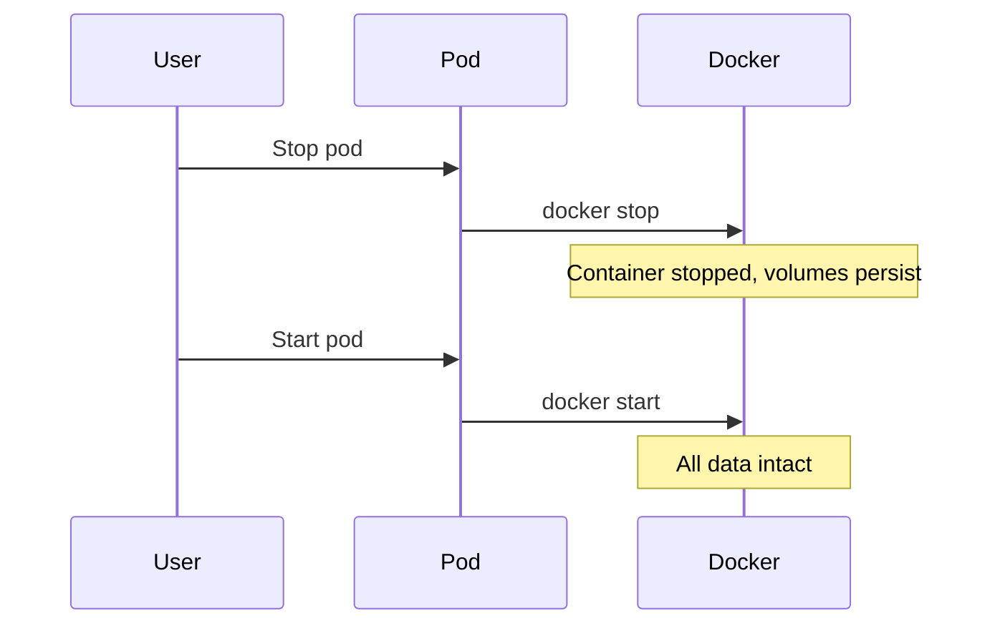
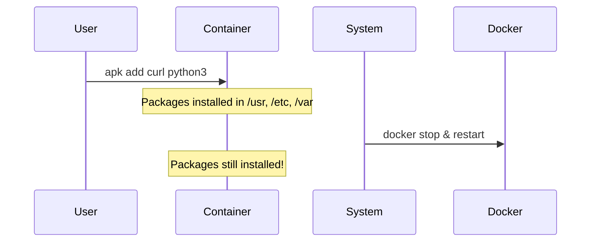
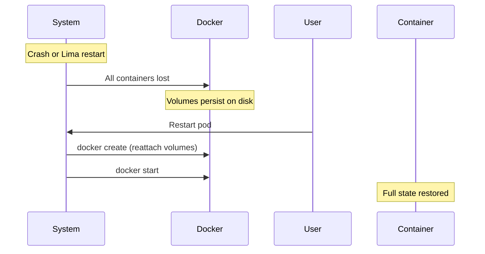
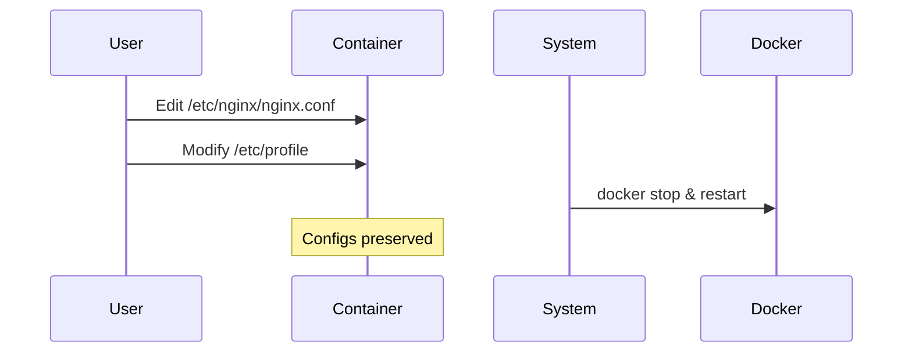

# Universal Volume Persistence System

## Overview

Pinacle treats each pod as a **personal virtual machine** with complete filesystem persistence. Using Docker named volumes, the entire container filesystem is preserved across all types of restarts - normal stops, crashes, or Lima VM restarts. Users can modify anything and it will persist.

## Philosophy

**Pods are personal VMs, not ephemeral containers.**

Users expect their environment to persist just like a real computer. They should be able to:
- Install packages with `apk add`
- Modify system configs in `/etc`
- Install software in `/usr/local`
- Create databases in `/var`
- **Have everything persist across restarts**

This is achieved by mounting Docker volumes for all major filesystem locations.

## Architecture

### Universal Volumes (Applied to All Pods)

Every pod automatically gets volumes for these directories:

| Volume | Mount Path | Contents |
|--------|------------|----------|
| `workspace` | `/workspace` | User code and projects |
| `home` | `/home` | User home directories |
| `root` | `/root` | Root's home directory |
| `etc` | `/etc` | System configurations |
| `usr-local` | `/usr/local` | Locally installed software |
| `opt` | `/opt` | Optional software packages |
| `var` | `/var` | Logs, databases, caches, mail, etc. |
| `srv` | `/srv` | Service data |

**Volume naming convention**: `pinacle-vol-{podId}-{volumeName}`

Example: `pinacle-vol-abc123-etc` mounts to `/etc`

### What Does NOT Persist

Only virtual and temporary filesystems are excluded:

- `/tmp` - Temporary files
- `/proc` - Process information (virtual)
- `/sys` - System information (virtual)
- `/dev` - Device files (virtual)
- `/run` - Runtime data (temporary)

These directories are either virtual (kernel-provided) or intentionally temporary.

## Implementation

### Automatic Volume Creation

Volumes are created automatically in `GVisorRuntime.createContainer()`:

```typescript:src/lib/pod-orchestration/container-runtime.ts
private getUniversalVolumes(): Array<{ name: string; path: string }> {
  return [
    { name: "workspace", path: "/workspace" },
    { name: "home", path: "/home" },
    { name: "root", path: "/root" },
    { name: "etc", path: "/etc" },
    { name: "usr-local", path: "/usr/local" },
    { name: "opt", path: "/opt" },
    { name: "var", path: "/var" },
    { name: "srv", path: "/srv" },
  ];
}

// Create all volumes before container creation
const volumes = this.getUniversalVolumes();
for (const volume of volumes) {
  await this.createVolume(spec.id, volume.name);
}
```

### Volume Mounting

Docker automatically mounts volumes when the container is created:

```bash
docker create \
  -v pinacle-vol-abc123-workspace:/workspace \
  -v pinacle-vol-abc123-home:/home \
  -v pinacle-vol-abc123-root:/root \
  -v pinacle-vol-abc123-etc:/etc \
  -v pinacle-vol-abc123-usr-local:/usr/local \
  -v pinacle-vol-abc123-opt:/opt \
  -v pinacle-vol-abc123-var:/var \
  -v pinacle-vol-abc123-srv:/srv \
  ...
```

### Volume Lifecycle

- **Creation**: Volumes created before container
- **Persistence**: Volumes persist through:
  - Container stop (`docker stop`)
  - Container removal (`docker rm`)
  - Lima VM restart
  - Host machine reboot
- **Reattachment**: Same pod ID = same volume names = automatic reattachment
- **Deletion**: Only deleted on permanent pod deletion (`deletePod()`)

## Persistence Scenarios

### Scenario 1: Normal Stop/Start



**Result**: Everything persists ✅

### Scenario 2: Package Installation



**Result**: System packages persist ✅

### Scenario 3: Unexpected Crash



**Result**: Complete recovery ✅

### Scenario 4: Configuration Changes



**Result**: All config changes persist ✅

## Benefits

### For Users

1. **Predictable behavior** - Just like a real VM
2. **No surprises** - Everything persists automatically
3. **Freedom to customize** - Install anything, modify anything
4. **Resilience** - Survives crashes and restarts
5. **No manual snapshots needed** - For normal operations

### For the System

1. **Simpler mental model** - "It's a VM" vs complex persistence rules
2. **No selective sync** - Don't need to track what should persist
3. **Snapshots become optional** - For backups, not basic persistence
4. **Better user experience** - Less friction, fewer support issues

## Storage Considerations

### Disk Usage

- Each pod gets 8 volumes (workspace, home, root, etc, usr-local, opt, var, srv)
- Volumes grow dynamically as data is added
- Total size counts toward pod's storage tier limit
- Empty volumes use minimal space

### Volume Location

- **Lima VMs**: Stored in `~/.lima/*/diffdisk`
- **Production**: Docker host filesystem
- **Backups**: Covered by pod snapshots

### Cleanup

```typescript
// Temporary stop (keeps volumes)
await podManager.stopPod();

// Permanent deletion (removes volumes)
await podManager.deletePod();  // removeVolumes: true
```

## Comparison to Snapshots

### Volumes (Always Active)

- ✅ Instant persistence
- ✅ No storage overhead (S3/filesystem)
- ✅ Automatic recovery from crashes
- ✅ No user action needed
- ❌ No versioning
- ❌ No off-server backup

### Snapshots (Optional)

- ✅ Full system backup
- ✅ Point-in-time restore
- ✅ Off-server storage (S3)
- ✅ Version history
- ❌ Slower (tar + upload)
- ❌ Requires manual creation

**Best practice**: Volumes for daily persistence, snapshots for backups and versioning.

## Integration Tests

Volume persistence is verified by:

1. **`should persist data in volumes across container stop/start`**
   - Tests basic stop/start cycle
   - Verifies files persist in all volume-mounted directories

2. **`should persist data across container removal and recreation`**
   - Simulates Lima restart (container removed, volumes preserved)
   - Creates new container, verifies data restored

3. **`should NOT persist system packages installed with apk`**
   - **OUTDATED** - This test is now incorrect!
   - System packages **do** persist with universal volumes
   - Should be updated to verify packages **do** persist

See `src/lib/pod-orchestration/__tests__/integration.test.ts`

## Future Enhancements

### Potential Improvements

1. **Volume encryption** - Encrypt sensitive volumes at rest
2. **Volume snapshots** - Faster backups using volume snapshots
3. **Volume migration** - Move volumes between servers
4. **Volume quotas** - Per-volume size limits
5. **Volume compression** - Reduce storage footprint
6. **Volume replication** - Cross-server redundancy

### Non-Goals

- **File-level versioning** - Use Git for code, snapshots for system
- **Cross-host portability** - Volumes are host-local by design
- **Automatic compression** - Trade-off: speed vs size

## Migration Notes

No migration needed - new pods automatically get universal volumes. Existing pods will get volumes on next recreation (if any).

## Summary

Universal volume persistence transforms Pinacle pods from ephemeral containers into **persistent virtual machines**. Users can customize freely, and everything persists automatically across all types of restarts.

**Key principle**: If it's not virtual (`/proc`, `/sys`) or temporary (`/tmp`, `/run`), it persists.
