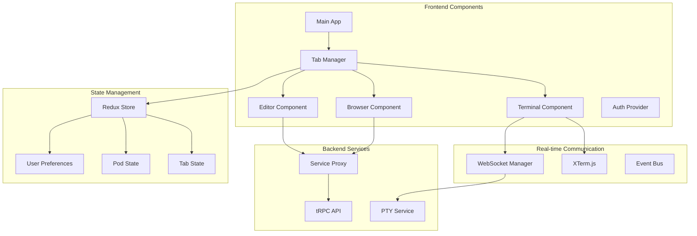
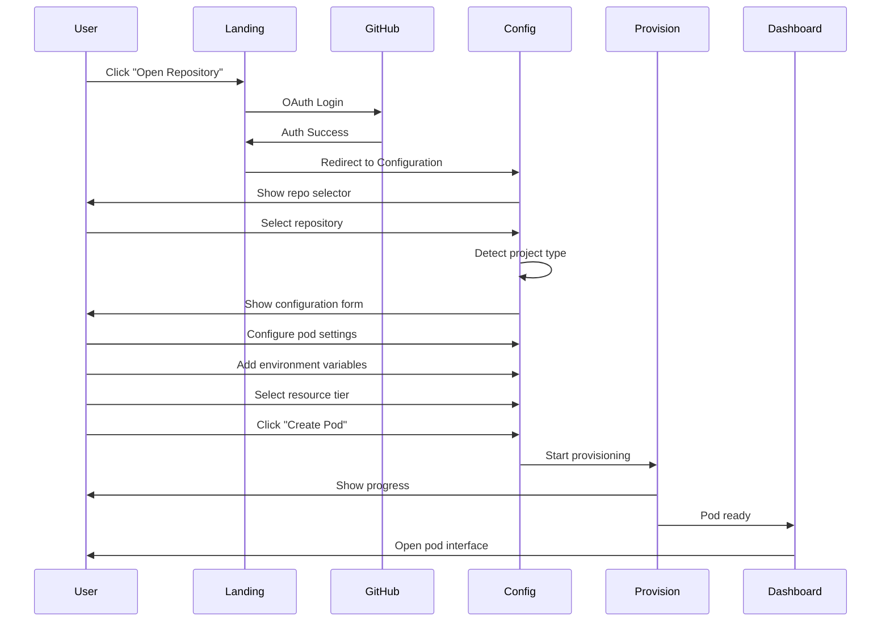

# User Experience and Tab System

## Overview

The user interface provides a unified, browser-based development environment with a flexible tab system that allows developers to access multiple services, terminals, and browsers within a single interface. The design prioritizes developer productivity with intelligent defaults and customization options.

## UI Architecture



## User Flow

### Pod Creation Flow



## Tab System Design

### Tab Types

```typescript
enum TabType {
  BROWSER = "browser",       // iFrame for web services
  TERMINAL = "terminal",     // XTerm.js terminal
  EDITOR = "editor",        // Monaco/CodeMirror editor
  KANBAN = "kanban",        // Vibe Kanban
  CLAUDE = "claude",        // Claude Code interface
  LOGS = "logs",            // Pod logs viewer
  METRICS = "metrics",      // Resource metrics
  FILES = "files"           // File explorer
}

interface Tab {
  id: string;
  type: TabType;
  name: string;
  icon: string;
  config: TabConfig;
  state: TabState;
  position: number;
  isPinned: boolean;
  isClosable: boolean;
}

interface TabConfig {
  // Browser tab config
  url?: string;
  allowNavigation?: boolean;
  allowPopups?: boolean;

  // Terminal tab config
  command?: string;
  cwd?: string;
  env?: Record<string, string>;
  shell?: string;

  // Editor tab config
  file?: string;
  language?: string;
  theme?: string;

  // Service-specific config
  serviceId?: string;
  port?: number;
}

interface TabState {
  isActive: boolean;
  isLoading: boolean;
  hasUnsavedChanges: boolean;
  error?: string;
  connectionId?: string;
  lastActivity: Date;
}
```

### Tab Manager Implementation

```typescript
class TabManager {
  private tabs: Map<string, Tab> = new Map();
  private activeTabId: string | null = null;
  private maxTabs: number = 10;

  async createTab(config: CreateTabConfig): Promise<Tab> {
    if (this.tabs.size >= this.maxTabs) {
      throw new Error(`Maximum ${this.maxTabs} tabs allowed`);
    }

    const tab: Tab = {
      id: generateId(),
      type: config.type,
      name: config.name || this.getDefaultName(config.type),
      icon: config.icon || this.getDefaultIcon(config.type),
      config: config.config || {},
      state: {
        isActive: false,
        isLoading: true,
        hasUnsavedChanges: false,
        lastActivity: new Date()
      },
      position: this.tabs.size,
      isPinned: config.isPinned || false,
      isClosable: config.isClosable !== false
    };

    // Initialize tab based on type
    await this.initializeTab(tab);

    // Add to collection
    this.tabs.set(tab.id, tab);

    // Make active if first tab or requested
    if (this.tabs.size === 1 || config.makeActive) {
      await this.activateTab(tab.id);
    }

    // Persist to storage
    await this.saveTabState();

    // Emit event
    this.emit('tab:created', tab);

    return tab;
  }

  private async initializeTab(tab: Tab): Promise<void> {
    switch (tab.type) {
      case TabType.TERMINAL:
        await this.initializeTerminal(tab);
        break;

      case TabType.BROWSER:
        await this.initializeBrowser(tab);
        break;

      case TabType.EDITOR:
        await this.initializeEditor(tab);
        break;

      default:
        await this.initializeService(tab);
    }
  }

  private async initializeTerminal(tab: Tab): Promise<void> {
    // Create PTY session
    const session = await api.terminals.create({
      podId: this.podId,
      command: tab.config.command || '/bin/bash',
      cwd: tab.config.cwd || '/workspace',
      env: tab.config.env || {}
    });

    tab.state.connectionId = session.id;

    // Set up WebSocket connection
    const ws = new WebSocket(`wss://api.pinacle.dev/terminals/${session.id}`);

    ws.onopen = () => {
      tab.state.isLoading = false;
      this.updateTab(tab);
    };

    ws.onerror = (error) => {
      tab.state.error = 'Connection failed';
      this.updateTab(tab);
    };
  }

  async closeTab(tabId: string): Promise<void> {
    const tab = this.tabs.get(tabId);
    if (!tab) return;

    // Check for unsaved changes
    if (tab.state.hasUnsavedChanges) {
      const confirmed = await this.confirmClose(tab);
      if (!confirmed) return;
    }

    // Clean up resources
    await this.cleanupTab(tab);

    // Remove from collection
    this.tabs.delete(tabId);

    // Reposition remaining tabs
    this.repositionTabs();

    // Activate another tab if this was active
    if (this.activeTabId === tabId) {
      const nextTab = Array.from(this.tabs.values())[0];
      if (nextTab) {
        await this.activateTab(nextTab.id);
      }
    }

    // Persist state
    await this.saveTabState();

    // Emit event
    this.emit('tab:closed', tab);
  }
}
```

## Component Architecture

### Terminal Component

```tsx
import { Terminal } from 'xterm';
import { FitAddon } from 'xterm-addon-fit';
import { WebLinksAddon } from 'xterm-addon-web-links';
import { SearchAddon } from 'xterm-addon-search';

const TerminalTab: React.FC<{ tab: Tab }> = ({ tab }) => {
  const terminalRef = useRef<HTMLDivElement>(null);
  const terminal = useRef<Terminal>();
  const ws = useRef<WebSocket>();

  useEffect(() => {
    if (!terminalRef.current) return;

    // Initialize XTerm.js
    terminal.current = new Terminal({
      cursorBlink: true,
      fontSize: 14,
      fontFamily: 'JetBrains Mono, monospace',
      theme: {
        background: '#1e1e1e',
        foreground: '#d4d4d4',
        cursor: '#aeafad',
        selection: '#264f78',
        black: '#000000',
        red: '#cd3131',
        green: '#0dbc79',
        yellow: '#e5e510',
        blue: '#2472c8',
        magenta: '#bc3fbc',
        cyan: '#11a8cd',
        white: '#e5e5e5'
      }
    });

    // Add addons
    const fitAddon = new FitAddon();
    const searchAddon = new SearchAddon();
    const webLinksAddon = new WebLinksAddon();

    terminal.current.loadAddon(fitAddon);
    terminal.current.loadAddon(searchAddon);
    terminal.current.loadAddon(webLinksAddon);

    // Open terminal
    terminal.current.open(terminalRef.current);
    fitAddon.fit();

    // Connect WebSocket
    ws.current = new WebSocket(
      `wss://api.pinacle.dev/terminals/${tab.state.connectionId}`
    );

    ws.current.onmessage = (event) => {
      terminal.current?.write(event.data);
    };

    // Send input to server
    terminal.current.onData((data) => {
      ws.current?.send(JSON.stringify({ type: 'input', data }));
    });

    // Handle resize
    terminal.current.onResize((size) => {
      ws.current?.send(JSON.stringify({
        type: 'resize',
        cols: size.cols,
        rows: size.rows
      }));
    });

    // Handle window resize
    const handleResize = () => fitAddon.fit();
    window.addEventListener('resize', handleResize);

    return () => {
      terminal.current?.dispose();
      ws.current?.close();
      window.removeEventListener('resize', handleResize);
    };
  }, [tab.state.connectionId]);

  return (
    <div className="terminal-container h-full w-full bg-gray-900">
      <div ref={terminalRef} className="h-full w-full" />
    </div>
  );
};
```

### Browser Tab Component

```tsx
const BrowserTab: React.FC<{ tab: Tab }> = ({ tab }) => {
  const iframeRef = useRef<HTMLIFrameElement>(null);
  const [isLoading, setIsLoading] = useState(true);
  const [currentUrl, setCurrentUrl] = useState(tab.config.url);
  const [canGoBack, setCanGoBack] = useState(false);
  const [canGoForward, setCanGoForward] = useState(false);

  // Generate authenticated URL
  const getAuthenticatedUrl = useCallback(() => {
    const token = getAuthToken();
    const url = new URL(tab.config.url!);
    url.searchParams.set('token', token);
    return url.toString();
  }, [tab.config.url]);

  // Handle navigation
  const navigate = useCallback((url: string) => {
    if (!tab.config.allowNavigation) return;

    if (iframeRef.current) {
      iframeRef.current.src = url;
      setCurrentUrl(url);
    }
  }, [tab.config.allowNavigation]);

  // Toolbar actions
  const refresh = () => {
    if (iframeRef.current) {
      iframeRef.current.src = iframeRef.current.src;
    }
  };

  const openExternal = () => {
    window.open(currentUrl, '_blank');
  };

  return (
    <div className="browser-container flex flex-col h-full">
      {/* Toolbar */}
      <div className="browser-toolbar flex items-center gap-2 p-2 bg-gray-800 border-b border-gray-700">
        <Button
          size="sm"
          variant="ghost"
          onClick={() => window.history.back()}
          disabled={!canGoBack}
        >
          <ChevronLeft className="h-4 w-4" />
        </Button>

        <Button
          size="sm"
          variant="ghost"
          onClick={() => window.history.forward()}
          disabled={!canGoForward}
        >
          <ChevronRight className="h-4 w-4" />
        </Button>

        <Button size="sm" variant="ghost" onClick={refresh}>
          <RefreshCw className="h-4 w-4" />
        </Button>

        <div className="flex-1 flex items-center gap-2">
          <div className="flex-1 bg-gray-900 rounded px-3 py-1 text-sm text-gray-300">
            {currentUrl}
          </div>
        </div>

        <Button size="sm" variant="ghost" onClick={openExternal}>
          <ExternalLink className="h-4 w-4" />
        </Button>
      </div>

      {/* iFrame */}
      <div className="flex-1 relative">
        {isLoading && (
          <div className="absolute inset-0 flex items-center justify-center bg-gray-900">
            <Loader2 className="h-8 w-8 animate-spin text-blue-500" />
          </div>
        )}

        <iframe
          ref={iframeRef}
          src={getAuthenticatedUrl()}
          className="w-full h-full border-0"
          sandbox="allow-same-origin allow-scripts allow-popups allow-forms"
          onLoad={() => setIsLoading(false)}
        />
      </div>
    </div>
  );
};
```

## Tab Persistence and Restoration

```typescript
class TabPersistence {
  async saveTabState(podId: string, tabs: Tab[]): Promise<void> {
    const state = {
      tabs: tabs.map(tab => ({
        id: tab.id,
        type: tab.type,
        name: tab.name,
        config: tab.config,
        position: tab.position,
        isPinned: tab.isPinned
      })),
      activeTabId: this.activeTabId,
      timestamp: new Date()
    };

    // Save to database
    await db.podTabStates.upsert({
      where: { podId },
      create: {
        podId,
        state: JSON.stringify(state)
      },
      update: {
        state: JSON.stringify(state),
        updatedAt: new Date()
      }
    });

    // Save to localStorage for quick access
    localStorage.setItem(`pod-tabs-${podId}`, JSON.stringify(state));
  }

  async restoreTabState(podId: string): Promise<TabState | null> {
    // Try localStorage first
    const cached = localStorage.getItem(`pod-tabs-${podId}`);
    if (cached) {
      const state = JSON.parse(cached);

      // Check if state is recent (< 1 hour old)
      const age = Date.now() - new Date(state.timestamp).getTime();
      if (age < 60 * 60 * 1000) {
        return state;
      }
    }

    // Fallback to database
    const saved = await db.podTabStates.findUnique({
      where: { podId }
    });

    if (saved) {
      return JSON.parse(saved.state);
    }

    return null;
  }
}
```

## Default Tab Configurations

```typescript
const defaultTabs: Record<string, Partial<Tab>[]> = {
  nextjs: [
    {
      type: TabType.BROWSER,
      name: 'Application',
      icon: 'globe',
      config: { url: 'https://app-{pod}-{user}.pinacle.dev' },
      isPinned: true
    },
    {
      type: TabType.BROWSER,
      name: 'Vibe Kanban',
      icon: 'kanban',
      config: { url: 'https://kanban-{pod}-{user}.pinacle.dev' },
      isPinned: true
    },
    {
      type: TabType.TERMINAL,
      name: 'Claude Code',
      icon: 'bot',
      config: { command: 'claude-code' },
      isPinned: true
    },
    {
      type: TabType.TERMINAL,
      name: 'Terminal',
      icon: 'terminal',
      config: { command: '/bin/bash', cwd: '/workspace' }
    },
    {
      type: TabType.BROWSER,
      name: 'VS Code',
      icon: 'code',
      config: { url: 'https://code-{pod}-{user}.pinacle.dev' }
    }
  ],

  django: [
    {
      type: TabType.BROWSER,
      name: 'Application',
      icon: 'globe',
      config: { url: 'https://app-{pod}-{user}.pinacle.dev' }
    },
    {
      type: TabType.BROWSER,
      name: 'Admin Panel',
      icon: 'settings',
      config: { url: 'https://app-{pod}-{user}.pinacle.dev/admin' }
    },
    {
      type: TabType.TERMINAL,
      name: 'Django Shell',
      icon: 'terminal',
      config: { command: 'python manage.py shell' }
    },
    {
      type: TabType.TERMINAL,
      name: 'Terminal',
      icon: 'terminal',
      config: { command: '/bin/bash' }
    }
  ]
};
```

## Responsive Design

```tsx
const PodInterface: React.FC = () => {
  const [isMobile] = useMediaQuery('(max-width: 768px)');
  const [sidebarOpen, setSidebarOpen] = useState(!isMobile);

  return (
    <div className="pod-interface h-screen flex flex-col bg-gray-900">
      {/* Header */}
      <header className="h-12 bg-gray-800 border-b border-gray-700 flex items-center px-4">
        <Button
          size="sm"
          variant="ghost"
          onClick={() => setSidebarOpen(!sidebarOpen)}
          className="md:hidden"
        >
          <Menu className="h-4 w-4" />
        </Button>

        <div className="flex-1 flex items-center gap-4">
          <h1 className="text-white font-semibold">{pod.name}</h1>
          <Badge variant={pod.status === 'running' ? 'success' : 'warning'}>
            {pod.status}
          </Badge>
        </div>

        <ResourceMetrics pod={pod} />
      </header>

      {/* Main content */}
      <div className="flex-1 flex overflow-hidden">
        {/* Sidebar - Tab list */}
        <aside className={`
          ${sidebarOpen ? 'w-64' : 'w-0'}
          ${isMobile ? 'absolute inset-y-12 z-50' : ''}
          bg-gray-800 border-r border-gray-700 transition-all duration-200
          overflow-hidden
        `}>
          <TabList
            tabs={tabs}
            activeTabId={activeTabId}
            onTabSelect={selectTab}
            onTabClose={closeTab}
            onTabReorder={reorderTabs}
          />
        </aside>

        {/* Tab content */}
        <main className="flex-1 bg-gray-900">
          <TabContent
            tab={activeTab}
            onUpdate={updateTab}
          />
        </main>
      </div>

      {/* Mobile tab switcher */}
      {isMobile && (
        <div className="h-12 bg-gray-800 border-t border-gray-700 flex overflow-x-auto">
          {tabs.map(tab => (
            <button
              key={tab.id}
              onClick={() => selectTab(tab.id)}
              className={`
                px-4 py-2 flex items-center gap-2 whitespace-nowrap
                ${activeTabId === tab.id ? 'bg-gray-700 text-white' : 'text-gray-400'}
              `}
            >
              <Icon name={tab.icon} className="h-4 w-4" />
              <span className="text-sm">{tab.name}</span>
            </button>
          ))}
        </div>
      )}
    </div>
  );
};
```

## Keyboard Shortcuts

```typescript
const keyboardShortcuts = {
  // Tab management
  'cmd+t': 'newTab',
  'cmd+w': 'closeTab',
  'cmd+shift+t': 'reopenTab',
  'cmd+1-9': 'selectTab',
  'cmd+tab': 'nextTab',
  'cmd+shift+tab': 'previousTab',

  // Terminal
  'cmd+c': 'terminalCopy',
  'cmd+v': 'terminalPaste',
  'cmd+k': 'terminalClear',
  'cmd+f': 'terminalSearch',

  // Navigation
  'cmd+p': 'quickOpen',
  'cmd+shift+p': 'commandPalette',
  'cmd+b': 'toggleSidebar',

  // Pod control
  'cmd+r': 'restartPod',
  'cmd+s': 'savePodState',
  'cmd+shift+s': 'downloadPodBackup'
};
```
